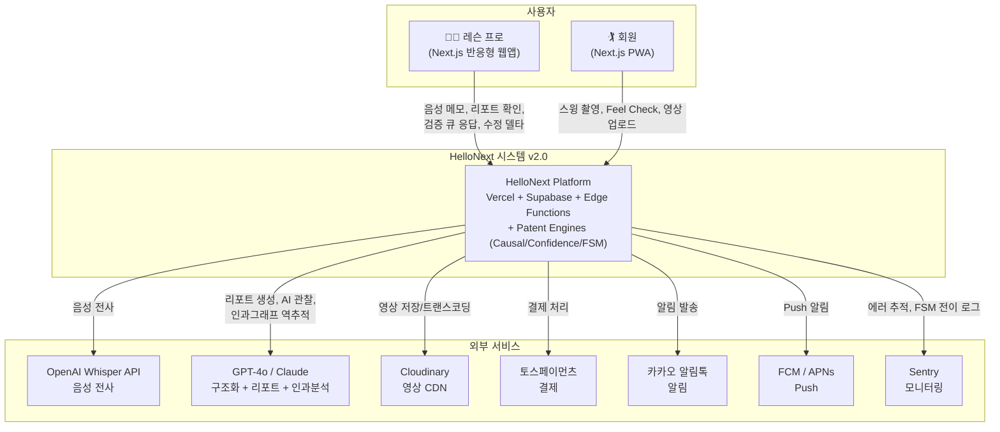
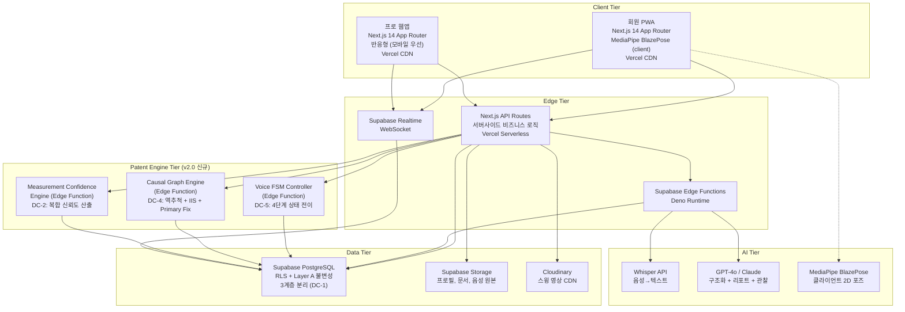
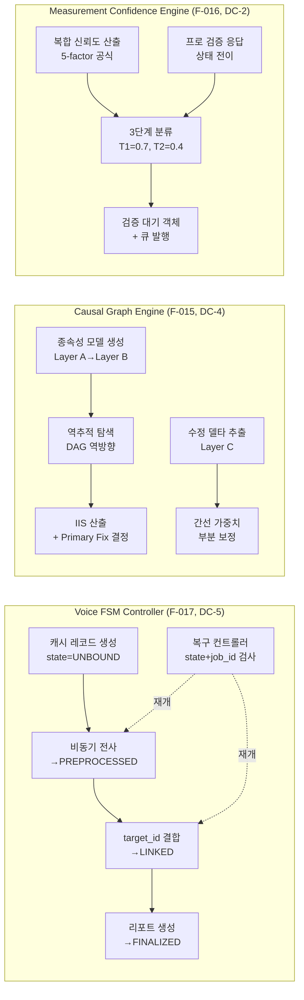
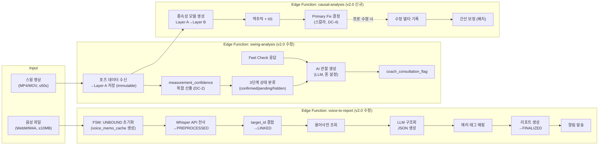
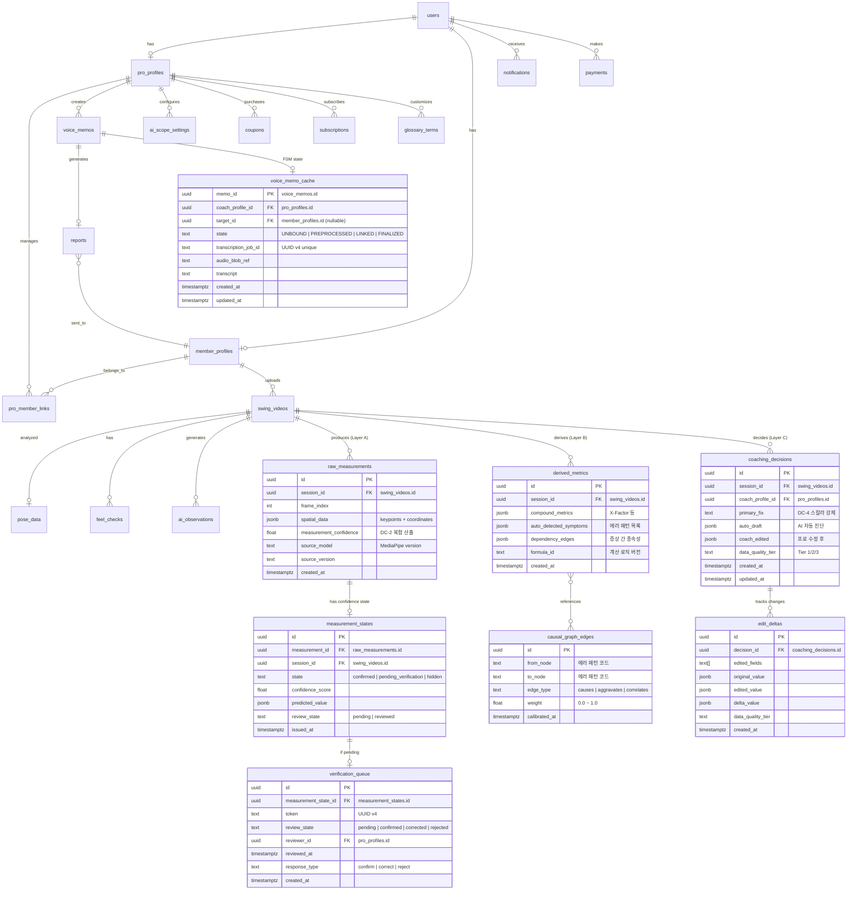
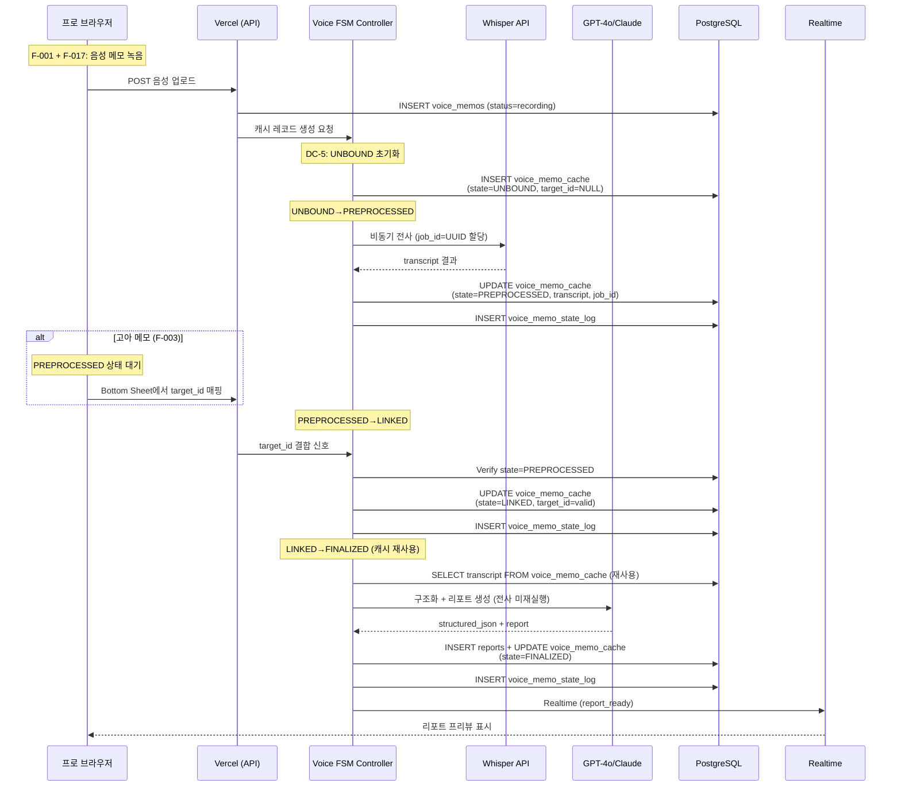
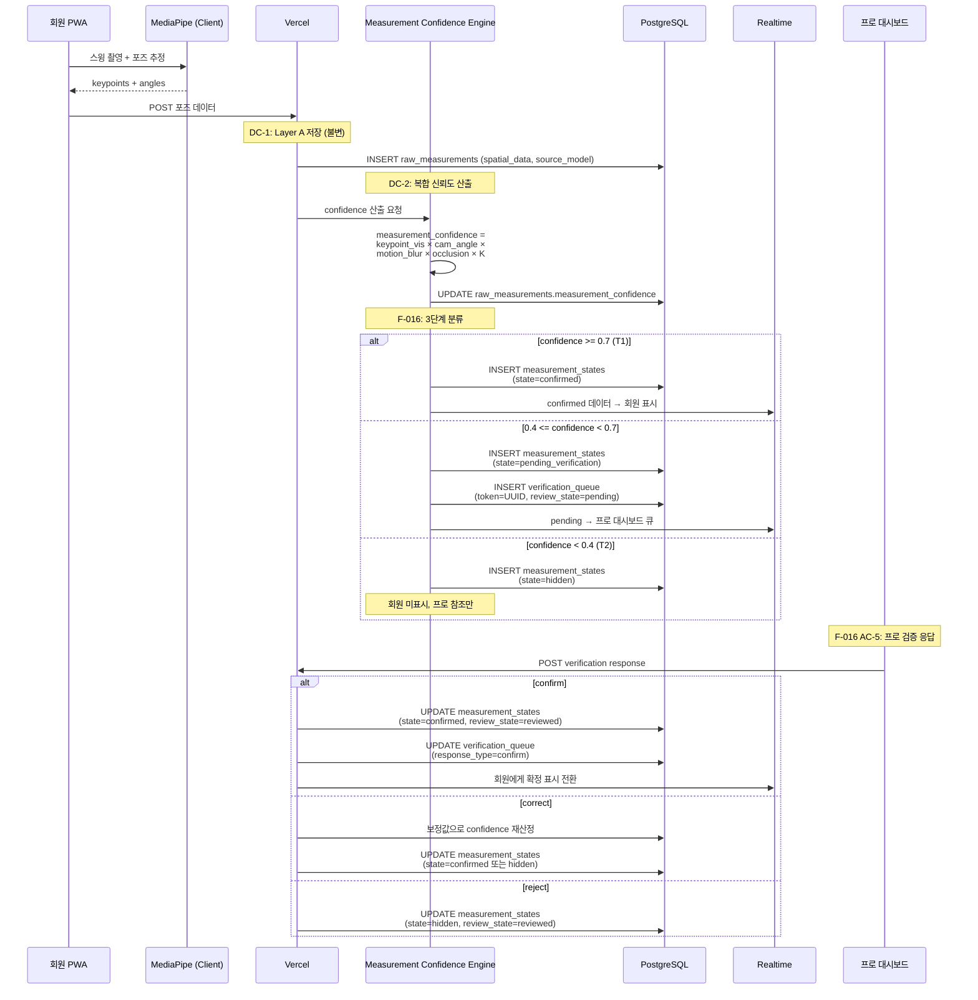
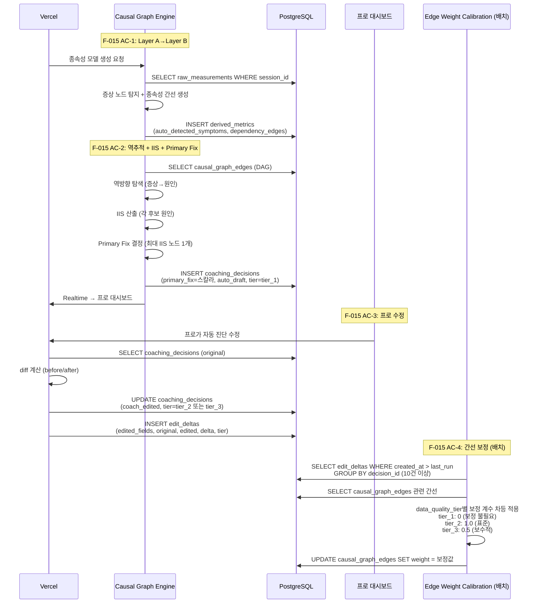
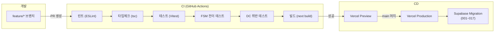
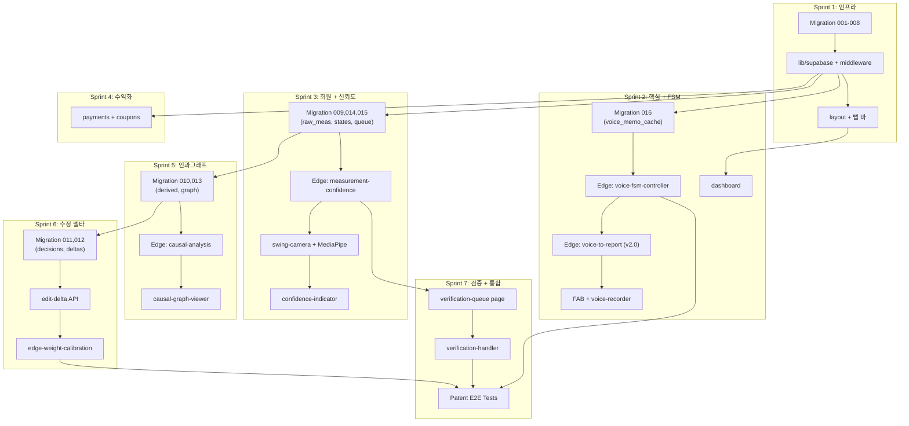

# Phase 3 — HelloNext 시스템 아키텍처 v2.0 (특허 통합)

> **작성일:** 2026-03-11
> **기반 문서:** PRD v2.0 (DC-1~DC-5, F-001~F-017), 특허1/3/4, instructions.md §3.0
> **설계 원칙:** 소규모 팀(1~3명), 부트스트랩 예산, 16주 MVP, Supabase-first
> **변경 범위:** v1.1 아키텍처 기반 + 특허 설계 제약 반영 (8개 신규 테이블, 3개 신규 Edge Function, 디렉토리 확장)

---

## A. 전체 시스템 다이어그램

### A-1. Context Diagram (C4 Level 1) — v2.0



### A-2. Container Diagram (C4 Level 2) — v2.0



### A-3. Component Diagram — Patent Engine Tier (v2.0 신규)



### A-4. Component Diagram — AI 파이프라인 (v1.1 기반 + v2.0 확장)



---

## B. 디렉토리 구조 v2.0

v1.1 구조 유지 + 특허 반영 파일 추가. `[v2.0]` 표시가 신규/수정 파일.

```
hellonext/
├── apps/
│   ├── web/
│   │   ├── public/
│   │   │   ├── manifest.json
│   │   │   ├── sw.js
│   │   │   └── icons/
│   │   ├── src/
│   │   │   ├── app/
│   │   │   │   ├── (auth)/
│   │   │   │   │   ├── login/page.tsx
│   │   │   │   │   ├── signup/page.tsx
│   │   │   │   │   └── role-select/page.tsx
│   │   │   │   ├── (pro)/
│   │   │   │   │   ├── layout.tsx
│   │   │   │   │   ├── onboarding/page.tsx
│   │   │   │   │   ├── dashboard/page.tsx
│   │   │   │   │   ├── review/page.tsx
│   │   │   │   │   ├── plan/page.tsx
│   │   │   │   │   ├── plan/[memberId]/
│   │   │   │   │   │   └── ai-scope/page.tsx
│   │   │   │   │   ├── coupons/page.tsx
│   │   │   │   │   ├── subscription/page.tsx
│   │   │   │   │   ├── verification-queue/page.tsx    # [v2.0] F-016: 검증 큐 대시보드
│   │   │   │   │   ├── causal-graph/page.tsx           # [v2.0] F-015: 인과그래프 뷰
│   │   │   │   │   └── settings/page.tsx
│   │   │   │   ├── (member)/
│   │   │   │   │   ├── layout.tsx
│   │   │   │   │   ├── onboarding/page.tsx
│   │   │   │   │   ├── practice/page.tsx              # [v2.0 수정] F-005: 신뢰도 표시
│   │   │   │   │   ├── swingbook/page.tsx
│   │   │   │   │   ├── progress/page.tsx
│   │   │   │   │   ├── coupon/page.tsx
│   │   │   │   │   └── settings/page.tsx
│   │   │   │   ├── api/
│   │   │   │   │   ├── auth/callback/route.ts
│   │   │   │   │   ├── payments/
│   │   │   │   │   │   ├── billing/route.ts
│   │   │   │   │   │   └── webhook/route.ts
│   │   │   │   │   ├── patent/                         # [v2.0] 특허 엔진 API 라우트
│   │   │   │   │   │   ├── verification/route.ts       # F-016: 검증 응답 처리
│   │   │   │   │   │   ├── causal-graph/route.ts       # F-015: 인과그래프 조회
│   │   │   │   │   │   └── edit-delta/route.ts         # F-015: 수정 델타 기록
│   │   │   │   │   └── cron/
│   │   │   │   │       ├── cleanup/route.ts
│   │   │   │   │       └── edge-calibration/route.ts   # [v2.0] F-015: 간선 보정 배치
│   │   │   │   ├── invite/[code]/page.tsx
│   │   │   │   └── layout.tsx
│   │   │   ├── components/
│   │   │   │   ├── ui/
│   │   │   │   │   ├── button.tsx
│   │   │   │   │   ├── card.tsx
│   │   │   │   │   ├── glass-card.tsx
│   │   │   │   │   ├── bottom-sheet.tsx
│   │   │   │   │   └── fab.tsx
│   │   │   │   ├── pro/
│   │   │   │   │   ├── voice-recorder.tsx
│   │   │   │   │   ├── report-preview.tsx
│   │   │   │   │   ├── member-card.tsx
│   │   │   │   │   ├── ai-scope-panel.tsx
│   │   │   │   │   ├── orphan-memo-badge.tsx
│   │   │   │   │   ├── data-sync-grid.tsx
│   │   │   │   │   ├── verification-card.tsx           # [v2.0] F-016: 검증 대기 카드
│   │   │   │   │   ├── verification-response.tsx       # [v2.0] F-016: confirm/correct/reject UI
│   │   │   │   │   ├── causal-graph-viewer.tsx         # [v2.0] F-015: DAG 시각화
│   │   │   │   │   ├── primary-fix-badge.tsx            # [v2.0] F-015: Primary Fix 강조
│   │   │   │   │   └── edit-delta-history.tsx           # [v2.0] F-015: 수정 이력 뷰
│   │   │   │   ├── member/
│   │   │   │   │   ├── swing-camera.tsx
│   │   │   │   │   ├── feel-check.tsx
│   │   │   │   │   ├── ai-observation.tsx
│   │   │   │   │   ├── video-dropzone.tsx
│   │   │   │   │   ├── timeline.tsx
│   │   │   │   │   ├── before-after.tsx
│   │   │   │   │   ├── feel-accuracy.tsx
│   │   │   │   │   └── confidence-indicator.tsx         # [v2.0] F-016: 신뢰도 인디케이터
│   │   │   │   ├── shared/
│   │   │   │   │   ├── notification-bell.tsx
│   │   │   │   │   ├── notification-list.tsx
│   │   │   │   │   └── coupon-input.tsx
│   │   │   │   └── layout/
│   │   │   │       ├── pro-tab-bar.tsx
│   │   │   │       └── member-tab-bar.tsx
│   │   │   ├── lib/
│   │   │   │   ├── supabase/
│   │   │   │   │   ├── client.ts
│   │   │   │   │   ├── server.ts
│   │   │   │   │   ├── middleware.ts
│   │   │   │   │   └── types.ts
│   │   │   │   ├── cloudinary/
│   │   │   │   │   ├── upload.ts
│   │   │   │   │   └── transform.ts
│   │   │   │   ├── payments/
│   │   │   │   │   ├── toss.ts
│   │   │   │   │   └── coupon.ts
│   │   │   │   ├── notifications/
│   │   │   │   │   ├── kakao.ts
│   │   │   │   │   └── fcm.ts
│   │   │   │   ├── mediapipe/
│   │   │   │   │   ├── pose-estimator.ts
│   │   │   │   │   └── angle-calculator.ts
│   │   │   │   ├── patent/                              # [v2.0] 특허 엔진 클라이언트 라이브러리
│   │   │   │   │   ├── confidence-calculator.ts         # DC-2: 5-factor 복합 신뢰도
│   │   │   │   │   ├── state-classifier.ts              # F-016: 3단계 분류
│   │   │   │   │   ├── data-layer-separator.ts          # DC-1: 3계층 분리 유틸
│   │   │   │   │   └── fsm-client.ts                    # DC-5: FSM 상태 전이 헬퍼
│   │   │   │   └── utils/
│   │   │   │       ├── video-compress.ts
│   │   │   │       └── format.ts
│   │   │   ├── hooks/
│   │   │   │   ├── use-voice-recorder.ts
│   │   │   │   ├── use-realtime.ts
│   │   │   │   ├── use-auth.ts
│   │   │   │   ├── use-notifications.ts
│   │   │   │   ├── use-verification-queue.ts            # [v2.0] F-016: 검증 큐 훅
│   │   │   │   └── use-causal-graph.ts                  # [v2.0] F-015: 인과그래프 훅
│   │   │   └── stores/
│   │   │       ├── auth-store.ts
│   │   │       ├── ui-store.ts
│   │   │       └── patent-store.ts                      # [v2.0] Zustand: FSM + 검증큐 상태
│   │   ├── middleware.ts
│   │   ├── next.config.js
│   │   ├── tailwind.config.ts
│   │   └── package.json
│   │
│   └── supabase/
│       ├── functions/
│       │   ├── voice-to-report/index.ts                 # [v2.0 수정] FSM 통합
│       │   ├── swing-analysis/index.ts                  # [v2.0 수정] 3계층 분리 + confidence
│       │   ├── send-notification/index.ts
│       │   ├── coupon-activate/index.ts
│       │   ├── voice-fsm-controller/index.ts            # [v2.0] F-017: FSM 전이 제어
│       │   ├── causal-analysis/index.ts                 # [v2.0] F-015: 역추적 + IIS
│       │   ├── measurement-confidence/index.ts          # [v2.0] F-016: 신뢰도 산출 + 분류
│       │   ├── verification-handler/index.ts            # [v2.0] F-016: 검증 응답 처리
│       │   └── edge-weight-calibration/index.ts         # [v2.0] F-015: 간선 보정 배치
│       ├── migrations/
│       │   ├── 001_users_and_profiles.sql
│       │   ├── 002_voice_memos_and_reports.sql
│       │   ├── 003_swing_videos_and_pose.sql
│       │   ├── 004_feel_checks_and_observations.sql
│       │   ├── 005_coupons_and_payments.sql
│       │   ├── 006_notifications.sql
│       │   ├── 007_error_patterns_seed.sql
│       │   ├── 008_rls_policies.sql
│       │   ├── 009_raw_measurements.sql                 # [v2.0] DC-1, DC-3: Layer A (불변)
│       │   ├── 010_derived_metrics.sql                  # [v2.0] DC-1: Layer B
│       │   ├── 011_coaching_decisions.sql               # [v2.0] DC-1, DC-4: Layer C
│       │   ├── 012_edit_deltas.sql                      # [v2.0] F-015: 수정 델타
│       │   ├── 013_causal_graph_edges.sql               # [v2.0] F-015: 인과그래프
│       │   ├── 014_measurement_states.sql               # [v2.0] F-016: 3단계 상태
│       │   ├── 015_verification_queue.sql               # [v2.0] F-016: 검증 큐
│       │   ├── 016_voice_memo_cache.sql                 # [v2.0] DC-5, F-017: FSM 캐시
│       │   └── 017_patent_rls_policies.sql              # [v2.0] 특허 테이블 RLS
│       ├── seed.sql
│       └── config.toml
│
├── packages/
│   └── shared/
│       ├── constants/
│       │   ├── error-patterns.ts
│       │   ├── swing-positions.ts
│       │   ├── fsm-states.ts                            # [v2.0] FSM 4상태 상수
│       │   ├── confidence-thresholds.ts                 # [v2.0] T1, T2, K 상수
│       │   └── causal-graph-seed.ts                     # [v2.0] 초기 DAG 정의
│       ├── types/
│       │   ├── report.ts
│       │   ├── pose.ts
│       │   ├── coupon.ts
│       │   ├── raw-measurement.ts                       # [v2.0] Layer A 타입
│       │   ├── derived-metric.ts                        # [v2.0] Layer B 타입
│       │   ├── coaching-decision.ts                     # [v2.0] Layer C 타입
│       │   ├── edit-delta.ts                            # [v2.0] 수정 델타 타입
│       │   ├── measurement-state.ts                     # [v2.0] 신뢰도 상태 타입
│       │   ├── verification.ts                          # [v2.0] 검증 큐 타입
│       │   └── voice-memo-cache.ts                      # [v2.0] FSM 캐시 타입
│       └── validators/
│           ├── voice-memo.ts
│           ├── coupon-code.ts
│           ├── fsm-transition.ts                        # [v2.0] FSM 전이 guard 검증
│           └── confidence-score.ts                      # [v2.0] 신뢰도 범위 검증
│
├── .github/workflows/
│   ├── ci.yml
│   └── deploy.yml
├── .env.example
├── turbo.json
└── README.md
```

**v2.0 추가 파일 요약: 35개 신규 파일**

| 영역 | 신규 파일 수 | 핵심 파일 |
|------|-------------|----------|
| 프로 페이지 | 2 | verification-queue, causal-graph |
| 프로 컴포넌트 | 5 | verification-card, causal-graph-viewer, primary-fix-badge 등 |
| 회원 컴포넌트 | 1 | confidence-indicator |
| API 라우트 | 4 | verification, causal-graph, edit-delta, edge-calibration |
| lib/patent/ | 4 | confidence-calculator, state-classifier 등 |
| hooks | 2 | use-verification-queue, use-causal-graph |
| stores | 1 | patent-store |
| Edge Functions | 5 | voice-fsm-controller, causal-analysis 등 |
| DB 마이그레이션 | 9 | 009~017 |
| shared/constants | 3 | fsm-states, confidence-thresholds, causal-graph-seed |
| shared/types | 7 | raw-measurement, derived-metric 등 |
| shared/validators | 2 | fsm-transition, confidence-score |

---

## C. 데이터베이스 스키마 v2.0

### C-1. ERD v2.0 (v1.1 + 특허 8개 테이블)



### C-2. 특허 테이블 CREATE TABLE SQL (마이그레이션 009~017)

#### 009_raw_measurements.sql (DC-1, DC-3: Layer A 불변)

```sql
/**
 * Migration 009: Raw Measurements (Layer A — Immutable)
 *
 * Patent 1 Claim 1(a): 제1 논리 계층 — 원시 측정값 저장
 * DC-1: 3계층 데이터 논리 분리
 * DC-3: 원시 측정값 불변성 (UPDATE 차단)
 *
 * Dependencies: 003_swing_videos_and_pose (swing_videos)
 */

CREATE TABLE public.raw_measurements (
    id UUID PRIMARY KEY DEFAULT gen_random_uuid(),
    session_id UUID NOT NULL REFERENCES public.swing_videos(id) ON DELETE CASCADE,
    frame_index INT NOT NULL CHECK (frame_index >= 0),
    spatial_data JSONB NOT NULL,
    measurement_confidence FLOAT CHECK (measurement_confidence >= 0 AND measurement_confidence <= 1),
    source_model TEXT NOT NULL DEFAULT 'mediapipe_blazepose',
    source_version TEXT NOT NULL DEFAULT '0.10.14',
    created_at TIMESTAMPTZ NOT NULL DEFAULT now(),

    UNIQUE(session_id, frame_index)
);

COMMENT ON TABLE public.raw_measurements IS 'Layer A (Patent 1): Immutable raw pose measurements. UPDATE prohibited by DC-3.';
COMMENT ON COLUMN public.raw_measurements.spatial_data IS 'Raw keypoints, joint coordinates, visibility scores from pose estimation';
COMMENT ON COLUMN public.raw_measurements.measurement_confidence IS 'DC-2: Composite confidence = keypoint_vis × cam_angle × motion_blur × occlusion × K';

CREATE INDEX idx_raw_meas_session ON public.raw_measurements(session_id, frame_index);
CREATE INDEX idx_raw_meas_confidence ON public.raw_measurements(session_id, measurement_confidence);

-- DC-3: Layer A 불변성 강제 — UPDATE 차단 트리거
CREATE OR REPLACE FUNCTION public.prevent_raw_measurement_update()
RETURNS TRIGGER AS $$
BEGIN
    RAISE EXCEPTION 'DC-3 VIOLATION: raw_measurements table is immutable. UPDATE operations are prohibited.';
    RETURN NULL;
END;
$$ LANGUAGE plpgsql;

CREATE TRIGGER enforce_raw_measurement_immutability
    BEFORE UPDATE ON public.raw_measurements
    FOR EACH ROW EXECUTE FUNCTION public.prevent_raw_measurement_update();

-- ROLLBACK:
-- DROP TRIGGER IF EXISTS enforce_raw_measurement_immutability ON public.raw_measurements;
-- DROP FUNCTION IF EXISTS public.prevent_raw_measurement_update();
-- DROP TABLE IF EXISTS public.raw_measurements;
```

#### 010_derived_metrics.sql (DC-1: Layer B)

```sql
/**
 * Migration 010: Derived Metrics (Layer B — Recalculable)
 *
 * Patent 1 Claim 1(b): 제2 논리 계층 — 파생 지표
 * DC-1: 3계층 데이터 논리 분리
 *
 * Dependencies: 003_swing_videos_and_pose, 009_raw_measurements
 */

CREATE TABLE public.derived_metrics (
    id UUID PRIMARY KEY DEFAULT gen_random_uuid(),
    session_id UUID NOT NULL REFERENCES public.swing_videos(id) ON DELETE CASCADE,
    compound_metrics JSONB NOT NULL DEFAULT '{}',
    auto_detected_symptoms JSONB NOT NULL DEFAULT '[]',
    dependency_edges JSONB NOT NULL DEFAULT '[]',
    formula_id TEXT NOT NULL DEFAULT 'v1.0',
    created_at TIMESTAMPTZ NOT NULL DEFAULT now(),
    recalculated_at TIMESTAMPTZ
);

COMMENT ON TABLE public.derived_metrics IS 'Layer B (Patent 1): Derived metrics computed from Layer A. Recalculable, not human-editable.';
COMMENT ON COLUMN public.derived_metrics.compound_metrics IS 'X-Factor, swing tempo, hip rotation etc.';
COMMENT ON COLUMN public.derived_metrics.auto_detected_symptoms IS 'Auto-detected error pattern nodes from analysis';
COMMENT ON COLUMN public.derived_metrics.dependency_edges IS 'Symptom-to-symptom dependency edges for causal graph input';
COMMENT ON COLUMN public.derived_metrics.formula_id IS 'Version of calculation logic for reproducibility';

CREATE INDEX idx_derived_session ON public.derived_metrics(session_id);

-- ROLLBACK:
-- DROP TABLE IF EXISTS public.derived_metrics;
```

#### 011_coaching_decisions.sql (DC-1, DC-4: Layer C)

```sql
/**
 * Migration 011: Coaching Decisions (Layer C — Coach-Editable)
 *
 * Patent 1 Claims 1(c)-(d): 제3 논리 계층 — 코칭 결정
 * DC-1: 3계층 데이터 논리 분리
 * DC-4: 단일 스칼라 Primary Fix 강제
 *
 * Dependencies: 003_swing_videos_and_pose, 001_users_and_profiles
 */

CREATE TABLE public.coaching_decisions (
    id UUID PRIMARY KEY DEFAULT gen_random_uuid(),
    session_id UUID NOT NULL REFERENCES public.swing_videos(id) ON DELETE CASCADE,
    coach_profile_id UUID NOT NULL REFERENCES public.pro_profiles(id),
    primary_fix TEXT,
    auto_draft JSONB NOT NULL DEFAULT '{}',
    coach_edited JSONB,
    data_quality_tier TEXT NOT NULL DEFAULT 'tier_1'
        CHECK (data_quality_tier IN ('tier_1', 'tier_2', 'tier_3')),
    created_at TIMESTAMPTZ NOT NULL DEFAULT now(),
    updated_at TIMESTAMPTZ NOT NULL DEFAULT now()
);

COMMENT ON TABLE public.coaching_decisions IS 'Layer C (Patent 1): Coach-editable coaching decisions. Ground truth labels.';
COMMENT ON COLUMN public.coaching_decisions.primary_fix IS 'DC-4: Single scalar Primary Fix node. Must reference exactly one error pattern code.';
COMMENT ON COLUMN public.coaching_decisions.data_quality_tier IS 'tier_1=AI unchanged, tier_2=partial edit, tier_3=full override';

CREATE INDEX idx_decisions_session ON public.coaching_decisions(session_id);
CREATE INDEX idx_decisions_coach ON public.coaching_decisions(coach_profile_id);
CREATE INDEX idx_decisions_tier ON public.coaching_decisions(data_quality_tier)
    WHERE data_quality_tier IN ('tier_2', 'tier_3');

CREATE TRIGGER set_coaching_decisions_updated_at
    BEFORE UPDATE ON public.coaching_decisions
    FOR EACH ROW EXECUTE FUNCTION public.handle_updated_at();

-- ROLLBACK:
-- DROP TRIGGER IF EXISTS set_coaching_decisions_updated_at ON public.coaching_decisions;
-- DROP TABLE IF EXISTS public.coaching_decisions;
```

#### 012_edit_deltas.sql (특허1 청구항3: 수정 델타)

```sql
/**
 * Migration 012: Edit Deltas
 *
 * Patent 1 Claims 1(d), 3: 수정 델타 레코드
 * 프로가 자동 진단을 수정할 때 before/after 차이를 영구 기록
 *
 * Dependencies: 011_coaching_decisions
 */

CREATE TABLE public.edit_deltas (
    id UUID PRIMARY KEY DEFAULT gen_random_uuid(),
    decision_id UUID NOT NULL REFERENCES public.coaching_decisions(id) ON DELETE CASCADE,
    edited_fields TEXT[] NOT NULL,
    original_value JSONB NOT NULL,
    edited_value JSONB NOT NULL,
    delta_value JSONB NOT NULL,
    data_quality_tier TEXT NOT NULL
        CHECK (data_quality_tier IN ('tier_1', 'tier_2', 'tier_3')),
    created_at TIMESTAMPTZ NOT NULL DEFAULT now()
);

COMMENT ON TABLE public.edit_deltas IS 'Patent 1 Claim 3: Edit delta records for RLHF and edge weight calibration';
COMMENT ON COLUMN public.edit_deltas.edited_fields IS 'Array of field names that were modified';
COMMENT ON COLUMN public.edit_deltas.delta_value IS 'Computed difference between original and edited values';

CREATE INDEX idx_deltas_decision ON public.edit_deltas(decision_id);
CREATE INDEX idx_deltas_tier ON public.edit_deltas(data_quality_tier)
    WHERE data_quality_tier IN ('tier_2', 'tier_3');
CREATE INDEX idx_deltas_created ON public.edit_deltas(created_at DESC);

-- ROLLBACK:
-- DROP TABLE IF EXISTS public.edit_deltas;
```

#### 013_causal_graph_edges.sql (특허1: 인과그래프)

```sql
/**
 * Migration 013: Causal Graph Edges
 *
 * Patent 1 Claims 1(b), 1(e): 인과 그래프 DAG 간선 + 부분 보정
 *
 * Dependencies: 007_error_patterns_seed (error_patterns)
 */

CREATE TABLE public.causal_graph_edges (
    id UUID PRIMARY KEY DEFAULT gen_random_uuid(),
    from_node TEXT NOT NULL,
    to_node TEXT NOT NULL,
    edge_type TEXT NOT NULL DEFAULT 'causes'
        CHECK (edge_type IN ('causes', 'aggravates', 'correlates')),
    weight FLOAT NOT NULL DEFAULT 0.5
        CHECK (weight >= 0.0 AND weight <= 1.0),
    calibrated_at TIMESTAMPTZ NOT NULL DEFAULT now(),
    calibration_count INT NOT NULL DEFAULT 0,

    UNIQUE(from_node, to_node, edge_type)
);

COMMENT ON TABLE public.causal_graph_edges IS 'Patent 1: Causal graph DAG edges between error pattern nodes. Weights partially calibrated via edit deltas.';
COMMENT ON COLUMN public.causal_graph_edges.from_node IS 'Source error pattern code (cause)';
COMMENT ON COLUMN public.causal_graph_edges.to_node IS 'Target error pattern code (effect/symptom)';
COMMENT ON COLUMN public.causal_graph_edges.weight IS 'Edge weight [0,1] calibrated by edit deltas';

CREATE INDEX idx_graph_from ON public.causal_graph_edges(from_node);
CREATE INDEX idx_graph_to ON public.causal_graph_edges(to_node);

-- 초기 시드: 22개 에러 패턴 기반 6개 인과 체인
-- (seed.sql에서 INSERT)

-- ROLLBACK:
-- DROP TABLE IF EXISTS public.causal_graph_edges;
```

#### 014_measurement_states.sql (특허3: 3단계 상태)

```sql
/**
 * Migration 014: Measurement States
 *
 * Patent 3 Claims 1(b)-(c): 3단계 신뢰도 상태 분류
 *
 * Dependencies: 009_raw_measurements
 */

CREATE TABLE public.measurement_states (
    id UUID PRIMARY KEY DEFAULT gen_random_uuid(),
    measurement_id UUID NOT NULL UNIQUE REFERENCES public.raw_measurements(id) ON DELETE CASCADE,
    session_id UUID NOT NULL REFERENCES public.swing_videos(id) ON DELETE CASCADE,
    state TEXT NOT NULL DEFAULT 'pending_verification'
        CHECK (state IN ('confirmed', 'pending_verification', 'hidden')),
    confidence_score FLOAT NOT NULL
        CHECK (confidence_score >= 0 AND confidence_score <= 1),
    predicted_value JSONB,
    review_state TEXT NOT NULL DEFAULT 'pending'
        CHECK (review_state IN ('pending', 'reviewed')),
    issued_at TIMESTAMPTZ NOT NULL DEFAULT now()
);

COMMENT ON TABLE public.measurement_states IS 'Patent 3: 3-tier state classification for each measurement based on confidence score';
COMMENT ON COLUMN public.measurement_states.state IS 'confirmed(>=0.7), pending_verification(0.4~0.7), hidden(<0.4)';

CREATE INDEX idx_meas_state_session ON public.measurement_states(session_id, state);
CREATE INDEX idx_meas_state_pending ON public.measurement_states(session_id)
    WHERE state = 'pending_verification' AND review_state = 'pending';
CREATE INDEX idx_meas_state_hidden ON public.measurement_states(session_id)
    WHERE state = 'hidden';

-- ROLLBACK:
-- DROP TABLE IF EXISTS public.measurement_states;
```

#### 015_verification_queue.sql (특허3: 검증 큐)

```sql
/**
 * Migration 015: Verification Queue
 *
 * Patent 3 Claims 1(c), 1(e): 검증 대기 객체 및 비동기 검증 큐
 *
 * Dependencies: 014_measurement_states, 001_users_and_profiles
 */

CREATE TABLE public.verification_queue (
    id UUID PRIMARY KEY DEFAULT gen_random_uuid(),
    measurement_state_id UUID NOT NULL UNIQUE REFERENCES public.measurement_states(id) ON DELETE CASCADE,
    token TEXT NOT NULL UNIQUE DEFAULT gen_random_uuid()::text,
    review_state TEXT NOT NULL DEFAULT 'pending'
        CHECK (review_state IN ('pending', 'confirmed', 'corrected', 'rejected')),
    reviewer_id UUID REFERENCES public.pro_profiles(id),
    reviewed_at TIMESTAMPTZ,
    response_type TEXT
        CHECK (response_type IS NULL OR response_type IN ('confirm', 'correct', 'reject')),
    created_at TIMESTAMPTZ NOT NULL DEFAULT now()
);

COMMENT ON TABLE public.verification_queue IS 'Patent 3: Async verification queue for pending_verification measurements. Tokens issued only for pending state.';

CREATE INDEX idx_verif_pending ON public.verification_queue(review_state)
    WHERE review_state = 'pending';
CREATE INDEX idx_verif_reviewer ON public.verification_queue(reviewer_id)
    WHERE review_state = 'pending';

-- ROLLBACK:
-- DROP TABLE IF EXISTS public.verification_queue;
```

#### 016_voice_memo_cache.sql (DC-5, 특허4: FSM 캐시)

```sql
/**
 * Migration 016: Voice Memo Cache (FSM State Management)
 *
 * Patent 4 Claims 1(a)-(e): 4단계 FSM + 캐시 재사용
 * DC-5: 엄격한 상태 전이 규칙
 *
 * Dependencies: 002_voice_memos_and_reports, 001_users_and_profiles
 */

CREATE TABLE public.voice_memo_cache (
    memo_id UUID PRIMARY KEY REFERENCES public.voice_memos(id) ON DELETE CASCADE,
    coach_profile_id UUID NOT NULL REFERENCES public.pro_profiles(id),
    target_id UUID REFERENCES public.member_profiles(id),
    state TEXT NOT NULL DEFAULT 'UNBOUND'
        CHECK (state IN ('UNBOUND', 'PREPROCESSED', 'LINKED', 'FINALIZED')),
    transcription_job_id TEXT UNIQUE,
    audio_blob_ref TEXT NOT NULL,
    transcript TEXT,
    created_at TIMESTAMPTZ NOT NULL DEFAULT now(),
    updated_at TIMESTAMPTZ NOT NULL DEFAULT now()
);

COMMENT ON TABLE public.voice_memo_cache IS 'Patent 4 DC-5: 4-state FSM for voice memo lifecycle. Cache reuse prevents duplicate transcription.';
COMMENT ON COLUMN public.voice_memo_cache.state IS 'UNBOUND→PREPROCESSED→LINKED→FINALIZED. No state skips allowed.';
COMMENT ON COLUMN public.voice_memo_cache.target_id IS 'Patent 4 Claim 2: Must be NULL in UNBOUND and PREPROCESSED states.';

CREATE INDEX idx_cache_state ON public.voice_memo_cache(state)
    WHERE state IN ('UNBOUND', 'PREPROCESSED', 'LINKED');
CREATE INDEX idx_cache_coach ON public.voice_memo_cache(coach_profile_id, state);

-- DC-5: target_id NULL 불변조건 강제
CREATE OR REPLACE FUNCTION public.enforce_target_id_null_invariant()
RETURNS TRIGGER AS $$
BEGIN
    IF NEW.state IN ('UNBOUND', 'PREPROCESSED') AND NEW.target_id IS NOT NULL THEN
        RAISE EXCEPTION 'DC-5 VIOLATION: target_id must be NULL in state % (Patent 4 Claim 2)', NEW.state;
    END IF;
    IF NEW.state IN ('LINKED', 'FINALIZED') AND NEW.target_id IS NULL THEN
        RAISE EXCEPTION 'DC-5 VIOLATION: target_id must NOT be NULL in state %', NEW.state;
    END IF;
    RETURN NEW;
END;
$$ LANGUAGE plpgsql;

CREATE TRIGGER enforce_voice_cache_target_invariant
    BEFORE INSERT OR UPDATE ON public.voice_memo_cache
    FOR EACH ROW EXECUTE FUNCTION public.enforce_target_id_null_invariant();

-- DC-5: 상태 전이 guard (스킵 방지)
CREATE OR REPLACE FUNCTION public.enforce_fsm_transition()
RETURNS TRIGGER AS $$
DECLARE
    valid_transitions JSONB := '{
        "UNBOUND": ["PREPROCESSED"],
        "PREPROCESSED": ["LINKED"],
        "LINKED": ["FINALIZED"]
    }'::JSONB;
    allowed TEXT[];
BEGIN
    IF OLD.state = NEW.state THEN
        RETURN NEW;
    END IF;

    IF OLD.state = 'FINALIZED' THEN
        RAISE EXCEPTION 'DC-5 VIOLATION: Cannot transition from FINALIZED state';
    END IF;

    SELECT array_agg(elem::text)
    INTO allowed
    FROM jsonb_array_elements_text(valid_transitions -> OLD.state) AS elem;

    IF NOT (NEW.state = ANY(allowed)) THEN
        RAISE EXCEPTION 'DC-5 VIOLATION: Invalid transition from % to % (Patent 4 Claim 1)', OLD.state, NEW.state;
    END IF;

    RETURN NEW;
END;
$$ LANGUAGE plpgsql;

CREATE TRIGGER enforce_voice_cache_fsm
    BEFORE UPDATE ON public.voice_memo_cache
    FOR EACH ROW EXECUTE FUNCTION public.enforce_fsm_transition();

-- 상태 전이 로그 (감사 추적)
CREATE TABLE public.voice_memo_state_log (
    id UUID PRIMARY KEY DEFAULT gen_random_uuid(),
    memo_id UUID NOT NULL REFERENCES public.voice_memos(id),
    from_state TEXT NOT NULL,
    to_state TEXT NOT NULL,
    transitioned_at TIMESTAMPTZ NOT NULL DEFAULT now(),
    metadata JSONB
);

CREATE OR REPLACE FUNCTION public.log_fsm_transition()
RETURNS TRIGGER AS $$
BEGIN
    IF OLD.state != NEW.state THEN
        INSERT INTO public.voice_memo_state_log (memo_id, from_state, to_state, metadata)
        VALUES (NEW.memo_id, OLD.state, NEW.state,
                jsonb_build_object('target_id', NEW.target_id, 'job_id', NEW.transcription_job_id));
    END IF;
    RETURN NEW;
END;
$$ LANGUAGE plpgsql;

CREATE TRIGGER log_voice_cache_transition
    AFTER UPDATE ON public.voice_memo_cache
    FOR EACH ROW EXECUTE FUNCTION public.log_fsm_transition();

CREATE TRIGGER set_voice_memo_cache_updated_at
    BEFORE UPDATE ON public.voice_memo_cache
    FOR EACH ROW EXECUTE FUNCTION public.handle_updated_at();

-- ROLLBACK:
-- DROP TRIGGER IF EXISTS set_voice_memo_cache_updated_at ON public.voice_memo_cache;
-- DROP TRIGGER IF EXISTS log_voice_cache_transition ON public.voice_memo_cache;
-- DROP TRIGGER IF EXISTS enforce_voice_cache_fsm ON public.voice_memo_cache;
-- DROP TRIGGER IF EXISTS enforce_voice_cache_target_invariant ON public.voice_memo_cache;
-- DROP TABLE IF EXISTS public.voice_memo_state_log;
-- DROP TABLE IF EXISTS public.voice_memo_cache;
-- DROP FUNCTION IF EXISTS public.log_fsm_transition();
-- DROP FUNCTION IF EXISTS public.enforce_fsm_transition();
-- DROP FUNCTION IF EXISTS public.enforce_target_id_null_invariant();
```

#### 017_patent_rls_policies.sql (특허 테이블 RLS)

```sql
/**
 * Migration 017: RLS Policies for Patent Tables
 *
 * Row Level Security for all v2.0 patent-derived tables.
 * Key policy: raw_measurements has NO UPDATE policy (DC-3 immutability).
 * Hidden measurement_states are excluded from member access path (Patent 3 Claim 1(d)).
 *
 * Dependencies: 009~016 patent tables
 */

-- Enable RLS on all patent tables
ALTER TABLE public.raw_measurements ENABLE ROW LEVEL SECURITY;
ALTER TABLE public.derived_metrics ENABLE ROW LEVEL SECURITY;
ALTER TABLE public.coaching_decisions ENABLE ROW LEVEL SECURITY;
ALTER TABLE public.edit_deltas ENABLE ROW LEVEL SECURITY;
ALTER TABLE public.causal_graph_edges ENABLE ROW LEVEL SECURITY;
ALTER TABLE public.measurement_states ENABLE ROW LEVEL SECURITY;
ALTER TABLE public.verification_queue ENABLE ROW LEVEL SECURITY;
ALTER TABLE public.voice_memo_cache ENABLE ROW LEVEL SECURITY;
ALTER TABLE public.voice_memo_state_log ENABLE ROW LEVEL SECURITY;

-- ============================
-- raw_measurements: DC-3 불변 — SELECT + INSERT only, NO UPDATE
-- ============================
-- 회원: 자기 세션만 읽기
CREATE POLICY raw_meas_member_read ON public.raw_measurements
    FOR SELECT USING (
        session_id IN (SELECT id FROM swing_videos WHERE member_id IN
            (SELECT id FROM member_profiles WHERE user_id = auth.uid()))
    );

-- 프로: 연결된 회원 세션 읽기
CREATE POLICY raw_meas_pro_read ON public.raw_measurements
    FOR SELECT USING (
        session_id IN (SELECT sv.id FROM swing_videos sv
            JOIN pro_member_links pml ON sv.member_id = pml.member_id
            WHERE pml.pro_id IN (SELECT id FROM pro_profiles WHERE user_id = auth.uid())
            AND pml.status = 'active')
    );

-- Edge Function (service_role): INSERT만
CREATE POLICY raw_meas_service_insert ON public.raw_measurements
    FOR INSERT WITH CHECK (true);
-- Note: UPDATE policy 없음 = DC-3 RLS 강제

-- ============================
-- measurement_states: 회원은 hidden 제외 (Patent 3 Claim 1(d))
-- ============================
-- 회원: confirmed + pending만 (데이터 접근 경로 분리)
CREATE POLICY meas_state_member ON public.measurement_states
    FOR SELECT USING (
        state != 'hidden' AND
        session_id IN (SELECT id FROM swing_videos WHERE member_id IN
            (SELECT id FROM member_profiles WHERE user_id = auth.uid()))
    );

-- 프로: 전체 (hidden 포함 — 참조 레코드 접근 가능)
CREATE POLICY meas_state_pro ON public.measurement_states
    FOR SELECT USING (
        session_id IN (SELECT sv.id FROM swing_videos sv
            JOIN pro_member_links pml ON sv.member_id = pml.member_id
            WHERE pml.pro_id IN (SELECT id FROM pro_profiles WHERE user_id = auth.uid())
            AND pml.status = 'active')
    );

-- ============================
-- verification_queue: 프로만 접근
-- ============================
CREATE POLICY verif_pro_read ON public.verification_queue
    FOR SELECT USING (
        reviewer_id IN (SELECT id FROM pro_profiles WHERE user_id = auth.uid())
        OR measurement_state_id IN (
            SELECT ms.id FROM measurement_states ms
            JOIN swing_videos sv ON ms.session_id = sv.id
            JOIN pro_member_links pml ON sv.member_id = pml.member_id
            WHERE pml.pro_id IN (SELECT id FROM pro_profiles WHERE user_id = auth.uid())
            AND pml.status = 'active'
        )
    );

CREATE POLICY verif_pro_update ON public.verification_queue
    FOR UPDATE USING (
        reviewer_id IN (SELECT id FROM pro_profiles WHERE user_id = auth.uid())
    );

-- ============================
-- coaching_decisions: 프로만 수정 가능 (DC-1 Layer C)
-- ============================
CREATE POLICY decisions_pro_all ON public.coaching_decisions
    FOR ALL USING (
        coach_profile_id IN (SELECT id FROM pro_profiles WHERE user_id = auth.uid())
    );

CREATE POLICY decisions_member_read ON public.coaching_decisions
    FOR SELECT USING (
        session_id IN (SELECT id FROM swing_videos WHERE member_id IN
            (SELECT id FROM member_profiles WHERE user_id = auth.uid()))
    );

-- ============================
-- edit_deltas: 프로만 읽기
-- ============================
CREATE POLICY deltas_pro_read ON public.edit_deltas
    FOR SELECT USING (
        decision_id IN (SELECT id FROM coaching_decisions
            WHERE coach_profile_id IN (SELECT id FROM pro_profiles WHERE user_id = auth.uid()))
    );

-- ============================
-- causal_graph_edges: 읽기 전용 (모든 인증 사용자)
-- ============================
CREATE POLICY graph_read_all ON public.causal_graph_edges
    FOR SELECT USING (auth.uid() IS NOT NULL);

-- ============================
-- voice_memo_cache: 프로만 (DC-5)
-- ============================
CREATE POLICY cache_pro_all ON public.voice_memo_cache
    FOR ALL USING (
        coach_profile_id IN (SELECT id FROM pro_profiles WHERE user_id = auth.uid())
    );

-- ============================
-- voice_memo_state_log: 읽기 전용
-- ============================
CREATE POLICY state_log_pro_read ON public.voice_memo_state_log
    FOR SELECT USING (
        memo_id IN (SELECT id FROM voice_memos
            WHERE pro_id IN (SELECT id FROM pro_profiles WHERE user_id = auth.uid()))
    );

-- ROLLBACK:
-- (drop all policies created above)
```

---

## D. 특허 데이터 플로우 (v2.0 신규)

### D-4. 음성 FSM 파이프라인 (F-017 + F-001 수정)



### D-5. 측정 신뢰도 3단계 상태 전이 (F-016 + F-005 수정)



### D-6. 인과그래프 역추적 + 수정 델타 보정 (F-015)



---

## E. 보안 아키텍처 v2.0

### E-1. v1.1 보안 유지 + 특허 추가 보안

| 보안 계층 | v1.1 | v2.0 추가 |
|----------|------|----------|
| 인증 | Supabase Auth + 카카오 OAuth | 변경 없음 |
| RLS | 14개 테이블 RLS | +9개 테이블 RLS (017_patent_rls) |
| Layer A 불변성 | 없음 | UPDATE 트리거 차단 + RLS UPDATE 정책 없음 (DC-3) |
| 데이터 접근 분리 | 없음 | hidden 측정값 회원 접근 차단 (Patent 3 Claim 1(d)) |
| FSM 무결성 | 없음 | 상태 전이 guard 트리거 + target_id NULL 불변 트리거 (DC-5) |
| 감사 추적 | 없음 | voice_memo_state_log 영구 보존 (모든 FSM 전이) |
| 수정 추적 | 없음 | edit_deltas 영구 보존 (모든 프로 수정) |
| API 보안 | Zod 스키마 + CORS | + FSM 전이 API에 state guard 미들웨어 |

### E-2. DC-3 불변성 다중 방어

```
Layer A (raw_measurements) 보호 계층:
├── 1. DB Trigger: prevent_raw_measurement_update() — UPDATE 시 EXCEPTION 발생
├── 2. RLS Policy: UPDATE 정책 미생성 — 사용자 레벨 UPDATE 불가
├── 3. API Layer: raw_measurements UPDATE API 엔드포인트 미노출
└── 4. Type System: TypeScript에서 readonly 타입 정의
```

---

## F. 인프라 및 배포 v2.0

### F-1. 환경 변수 추가 (.env.example v2.0)

```bash
# ============================
# v2.0 Patent Engine 설정
# ============================
# Measurement Confidence (DC-2)
CONFIDENCE_T1=0.7                    # confirmed 임계값
CONFIDENCE_T2=0.4                    # hidden 임계값
CONFIDENCE_K=1.0                     # 시스템 보정 상수 (초기값)

# Causal Graph Engine (F-015)
CAUSAL_GRAPH_VERSION=v1.0            # DAG 버전
EDGE_CALIBRATION_BATCH_SIZE=10       # 배치 보정 트리거 건수
EDGE_CALIBRATION_INTERVAL_HOURS=1    # 배치 보정 주기

# Voice FSM (DC-5)
FSM_RECOVERY_TIMEOUT_SEC=30          # 복구 RTT 목표
STT_MAX_RETRY=3                      # 전사 재시도 횟수

# Verification Queue (F-016)
VERIFICATION_DAILY_LIMIT_PER_PRO=50  # 프로당 일일 검증 한도
```

### F-2. CI/CD 파이프라인 v2.0



---

## G. 구현 로드맵 v2.0 — 16주 (v1.1 10주 + Patent Sprint 6주)

### G-1. Sprint 1~4 (v1.1 동일 + F-017 통합)

```
Sprint 1 (v0.1 Alpha, +2주) — v1.1 동일
═══════════════════════════════
[인프라 + 인증 + 온보딩]
F-007, F-006, Migration 001~008

Sprint 2 (v0.2 Alpha, +4주) — v2.0 수정
═══════════════════════════════
[핵심 루프 + FSM 통합]
├── F-001 (v2.0): voice-to-report + voice-fsm-controller 통합
│   → Migration 016 (voice_memo_cache) 선행
│   → AC-6~AC-8: FSM 4단계, target_id NULL 불변, 복구 제어
├── F-003 (v2.0): FAB + UNBOUND 초기화 + PREPROCESSED 대기
├── F-017: voice-fsm-controller Edge Function
├── F-002: 프로 대시보드
└── F-011 + F-014: 알림 시스템

Sprint 3 (v0.3 Beta, +6주) — v2.0 수정
═══════════════════════════════
[회원 앱 + 신뢰도 시스템]
├── F-005 (v2.0): 연습 탭 + measurement_confidence + 3단계
│   → Migration 009 (raw_measurements) + 014 (measurement_states)
│   → AC-8~AC-10: 복합 신뢰도, 3단계 분류, 3계층 분리
├── F-016: measurement-confidence Engine + 3단계 분류
│   → Migration 015 (verification_queue)
├── F-004: 스윙북
├── F-009: 드롭존
└── F-013: AI 범위 설정

Sprint 4 (v0.4 Beta, +8주) — v1.1 동일
═══════════════════════════════
[수익화 + Before/After]
F-008, F-012, F-010
```

### G-2. Sprint 5~7 (Patent Sprint — v2.0 신규)

```
Sprint 5 (v0.5 Patent Sprint 1, +10주)
═══════════════════════════════
[인과그래프 엔진 기초]
├── Migration 010 (derived_metrics) + 013 (causal_graph_edges)
├── F-015 AC-1: Layer A→Layer B 종속성 모델 생성
├── F-015 AC-2: 역추적 엔진 + IIS 산출 + Primary Fix
├── causal-analysis Edge Function
├── causal-graph-viewer 프로 컴포넌트
└── 초기 DAG 시드 (22 에러 패턴 + 6 체인)

Sprint 6 (v0.6 Patent Sprint 2, +12주)
═══════════════════════════════
[수정 델타 + 간선 보정]
├── Migration 011 (coaching_decisions) + 012 (edit_deltas)
├── F-015 AC-3: 수정 델타 추출 + Layer C 기록
├── F-015 AC-4: 간선 가중치 부분 보정 (배치)
├── DC-1/DC-3: 3계층 완전 분리 마이그레이션 검증
├── edit-delta API + edge-weight-calibration 배치
└── primary-fix-badge + edit-delta-history 컴포넌트

Sprint 7 (v0.7 Patent Sprint 3, +14주)
═══════════════════════════════
[검증 큐 + FSM 복구 + 통합 테스트]
├── F-016 AC-3~AC-5: 검증 대기 객체 + 프로 검증 워크플로우
├── F-017 AC-5: 서버 복구 E2E
├── verification-queue 프로 페이지 + 응답 UI
├── verification-handler Edge Function
├── Patent 통합 E2E 테스트
│   ├── FSM 복구 시나리오 5케이스
│   ├── 신뢰도 3단계 → 검증 → 전이 E2E
│   └── 역추적 → 수정 → 보정 E2E
└── 성능 최적화 (IIS 5초, confidence 1초, FSM 100ms)
```

### G-3. Sprint 8 (v1.0 MVP + v1.1 Patch)

```
Sprint 8 (v1.0 MVP Launch, +16주)
═══════════════════════════════
[전체 통합 + QA + 파일럿]
├── Phase 5: 테스트 피라미드 + OWASP + 성능
├── Phase 6: Docker + GitHub Actions + 모니터링
├── 파일럿: 프로 30명 + 회원 100명
└── 가정 검증: IIS 유효성, 부분 보정 효과, 검증 큐 참여율

v1.1 Patch (+18주)
═══════════════════════════════
피드백 반영 + 버그 수정 + UX 개선
```

### G-4. 파일 의존성 맵 v2.0



---

> **다음 단계: Phase 4 — 파일 단위 코드 생성 (특허 반영)**
> Sprint 2부터 시작: Migration 016 (voice_memo_cache) → voice-fsm-controller Edge Function → voice-to-report v2.0 수정
