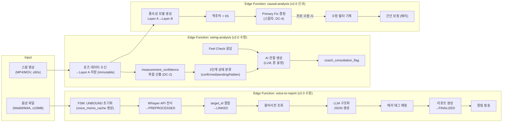
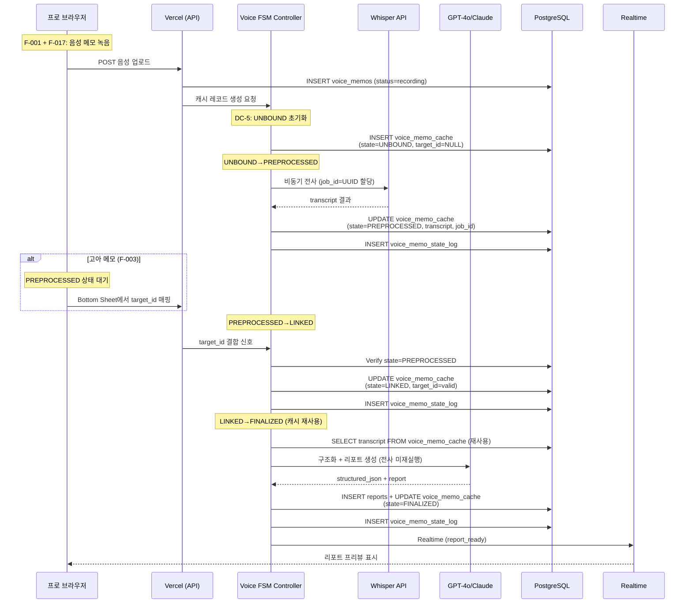
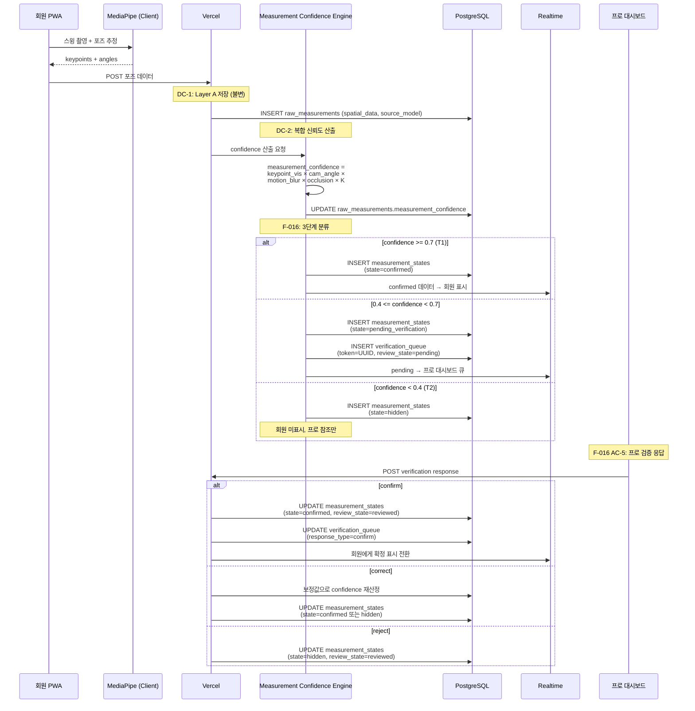
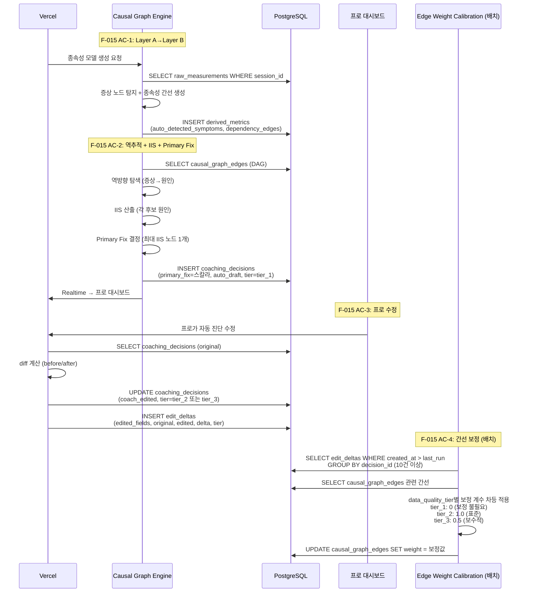

# HelloNext AI Pipeline Reference

## Overview

The HelloNext AI Pipeline orchestrates three core Edge Functions that handle voice-to-report generation, swing analysis with confidence measurement, and causal graph inference for intelligent coaching insights. This document provides the architectural diagrams and functional reference for Phase 3 v2.0 of the system.

---

## A-4. Component Diagram — AI 파이프라인 (v1.1 기반 + v2.0 확장)

---

## D-4. 음성 FSM 파이프라인 (F-017 + F-001 수정)

---

## D-5. 측정 신뢰도 3단계 상태 전이 (F-016 + F-005 수정)

---

## D-6. 인과그래프 역추적 + 수정 델타 보정 (F-015)

---

## Edge Functions Summary

### 1. voice-to-report

Handles conversion of coaching audio notes to structured reports through an FSM pipeline:

- **Initialization (UNBOUND)**: Creates a voice_memo_cache record with NULL target_id
- **Preprocessing**: Asynchronously transcribes audio via Whisper API, moves to PREPROCESSED state
- **Linking**: Receives target_id mapping (e.g., swing session, player) and transitions to LINKED state
- **Finalization**: Reuses cached transcript for LLM structuring, generates structured JSON and report, transitions to FINALIZED and notifies via Realtime
- **Notification**: Sends completion alerts to both pro dashboard and relevant stakeholders

Key feature: Caches transcript to avoid re-transcription when coaches correct/modify target associations.

### 2. swing-analysis

Processes swing video data to produce measurement-driven coaching insights:

- **Raw Measurement Layer A**: Stores immutable pose keypoints and angles from MediaPipe client detection
- **Confidence Engine (DC-2)**: Computes composite measurement_confidence = keypoint_visibility × camera_angle × motion_blur × occlusion × calibration_factor
- **3-tier Classification (F-016)**:
  - **T1 (confidence ≥ 0.7)**: Confirmed state, displayed to member
  - **T2 (0.4 ≤ confidence < 0.7)**: Pending verification, queued for pro review with UUID token
  - **T3 (confidence < 0.4)**: Hidden state, shown only to pro reference
- **AI Observation**: Generates LLM-based coaching insights with tone settings per coach
- **Pro Verification**: Coaches can confirm, correct (recalculate), or reject pending measurements; corrected values trigger state re-evaluation

### 3. causal-analysis

Infers root-cause relationships and determines primary coaching focus:

- **Dependency Modeling (AC-1)**: Converts raw Layer A measurements into Layer B derived metrics and symptom nodes; auto-detects causal edges (DAG)
- **Reverse Trace + IIS (AC-2)**: Performs backward graph search from symptoms to root causes; calculates Impact-Importance Score (IIS) for each candidate; selects single primary_fix scalar (highest IIS)
- **Pro Edits (AC-3)**: Coaches can override auto-diagnosis; system records original vs. edited coaching_decisions with data_quality_tier (tier_1/tier_2/tier_3)
- **Edge Calibration (AC-4)**: Batch process applies tier-based correction coefficients to causal_graph_edges:
  - tier_1 (auto): 0.0 (no correction)
  - tier_2 (coach-edited): 1.0 (standard)
  - tier_3 (conservative edits): 0.5 (conservative)

Together, these functions enable a complete loop from voice notes → measurement → causal inference → adaptive coaching recommendations.
