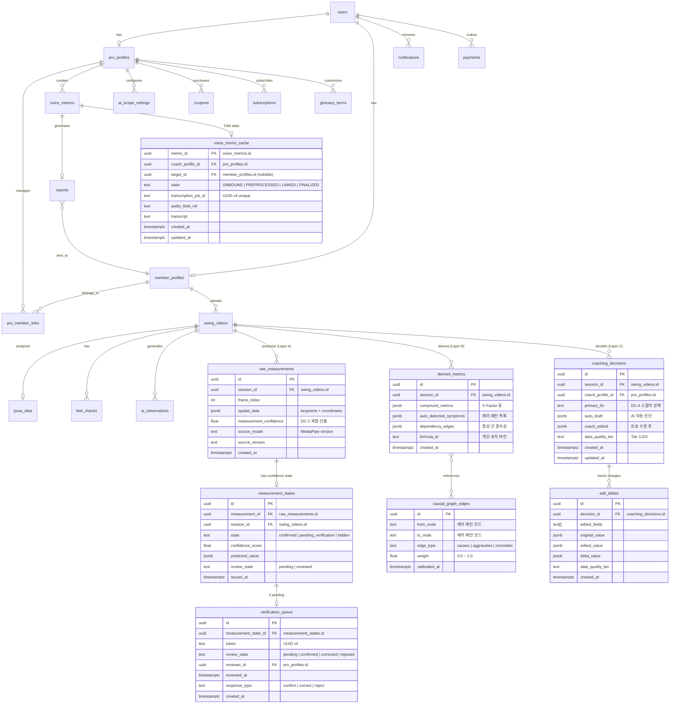

# HelloNext DB Schema Reference

This document extracts the database schema documentation from **HelloNext Phase 3 Architecture v2.0**. It includes the ERD diagram and all CREATE TABLE SQL statements for patent-related tables and migrations 009-017.

---

## Entity Relationship Diagram (ERD v2.0)



---

## CREATE TABLE SQL Statements

### Migration 009: raw_measurements.sql (DC-1, DC-3: Layer A — Immutable)

```sql
/**
 * Migration 009: Raw Measurements (Layer A — Immutable)
 *
 * Patent 1 Claim 1(a): 제1 논리 계층 — 원시 측정값 저장
 * DC-1: 3계층 데이터 논리 분리
 * DC-3: 원시 측정값 불변성 (UPDATE 차단)
 *
 * Dependencies: 003_swing_videos_and_pose (swing_videos)
 */

CREATE TABLE public.raw_measurements (
    id UUID PRIMARY KEY DEFAULT gen_random_uuid(),
    session_id UUID NOT NULL REFERENCES public.swing_videos(id) ON DELETE CASCADE,
    frame_index INT NOT NULL CHECK (frame_index >= 0),
    spatial_data JSONB NOT NULL,
    measurement_confidence FLOAT CHECK (measurement_confidence >= 0 AND measurement_confidence <= 1),
    source_model TEXT NOT NULL DEFAULT 'mediapipe_blazepose',
    source_version TEXT NOT NULL DEFAULT '0.10.14',
    created_at TIMESTAMPTZ NOT NULL DEFAULT now(),

    UNIQUE(session_id, frame_index)
);

COMMENT ON TABLE public.raw_measurements IS 'Layer A (Patent 1): Immutable raw pose measurements. UPDATE prohibited by DC-3.';
COMMENT ON COLUMN public.raw_measurements.spatial_data IS 'Raw keypoints, joint coordinates, visibility scores from pose estimation';
COMMENT ON COLUMN public.raw_measurements.measurement_confidence IS 'DC-2: Composite confidence = keypoint_vis × cam_angle × motion_blur × occlusion × K';

CREATE INDEX idx_raw_meas_session ON public.raw_measurements(session_id, frame_index);
CREATE INDEX idx_raw_meas_confidence ON public.raw_measurements(session_id, measurement_confidence);

-- DC-3: Layer A 불변성 강제 — UPDATE 차단 트리거
CREATE OR REPLACE FUNCTION public.prevent_raw_measurement_update()
RETURNS TRIGGER AS $$
BEGIN
    RAISE EXCEPTION 'DC-3 VIOLATION: raw_measurements table is immutable. UPDATE operations are prohibited.';
    RETURN NULL;
END;
$$ LANGUAGE plpgsql;

CREATE TRIGGER enforce_raw_measurement_immutability
    BEFORE UPDATE ON public.raw_measurements
    FOR EACH ROW EXECUTE FUNCTION public.prevent_raw_measurement_update();

-- ROLLBACK:
-- DROP TRIGGER IF EXISTS enforce_raw_measurement_immutability ON public.raw_measurements;
-- DROP FUNCTION IF EXISTS public.prevent_raw_measurement_update();
-- DROP TABLE IF EXISTS public.raw_measurements;
```

### Migration 010: derived_metrics.sql (DC-1: Layer B)

```sql
/**
 * Migration 010: Derived Metrics (Layer B — Recalculable)
 *
 * Patent 1 Claim 1(b): 제2 논리 계층 — 파생 지표
 * DC-1: 3계층 데이터 논리 분리
 *
 * Dependencies: 003_swing_videos_and_pose, 009_raw_measurements
 */

CREATE TABLE public.derived_metrics (
    id UUID PRIMARY KEY DEFAULT gen_random_uuid(),
    session_id UUID NOT NULL REFERENCES public.swing_videos(id) ON DELETE CASCADE,
    compound_metrics JSONB NOT NULL DEFAULT '{}',
    auto_detected_symptoms JSONB NOT NULL DEFAULT '[]',
    dependency_edges JSONB NOT NULL DEFAULT '[]',
    formula_id TEXT NOT NULL DEFAULT 'v1.0',
    created_at TIMESTAMPTZ NOT NULL DEFAULT now(),
    recalculated_at TIMESTAMPTZ
);

COMMENT ON TABLE public.derived_metrics IS 'Layer B (Patent 1): Derived metrics computed from Layer A. Recalculable, not human-editable.';
COMMENT ON COLUMN public.derived_metrics.compound_metrics IS 'X-Factor, swing tempo, hip rotation etc.';
COMMENT ON COLUMN public.derived_metrics.auto_detected_symptoms IS 'Auto-detected error pattern nodes from analysis';
COMMENT ON COLUMN public.derived_metrics.dependency_edges IS 'Symptom-to-symptom dependency edges for causal graph input';
COMMENT ON COLUMN public.derived_metrics.formula_id IS 'Version of calculation logic for reproducibility';

CREATE INDEX idx_derived_session ON public.derived_metrics(session_id);

-- ROLLBACK:
-- DROP TABLE IF EXISTS public.derived_metrics;
```

### Migration 011: coaching_decisions.sql (DC-1, DC-4: Layer C)

```sql
/**
 * Migration 011: Coaching Decisions (Layer C — Coach-Editable)
 *
 * Patent 1 Claims 1(c)-(d): 제3 논리 계층 — 코칭 결정
 * DC-1: 3계층 데이터 논리 분리
 * DC-4: 단일 스칼라 Primary Fix 강제
 *
 * Dependencies: 003_swing_videos_and_pose, 001_users_and_profiles
 */

CREATE TABLE public.coaching_decisions (
    id UUID PRIMARY KEY DEFAULT gen_random_uuid(),
    session_id UUID NOT NULL REFERENCES public.swing_videos(id) ON DELETE CASCADE,
    coach_profile_id UUID NOT NULL REFERENCES public.pro_profiles(id),
    primary_fix TEXT,
    auto_draft JSONB NOT NULL DEFAULT '{}',
    coach_edited JSONB,
    data_quality_tier TEXT NOT NULL DEFAULT 'tier_1'
        CHECK (data_quality_tier IN ('tier_1', 'tier_2', 'tier_3')),
    created_at TIMESTAMPTZ NOT NULL DEFAULT now(),
    updated_at TIMESTAMPTZ NOT NULL DEFAULT now()
);

COMMENT ON TABLE public.coaching_decisions IS 'Layer C (Patent 1): Coach-editable coaching decisions. Ground truth labels.';
COMMENT ON COLUMN public.coaching_decisions.primary_fix IS 'DC-4: Single scalar Primary Fix node. Must reference exactly one error pattern code.';
COMMENT ON COLUMN public.coaching_decisions.data_quality_tier IS 'tier_1=AI unchanged, tier_2=partial edit, tier_3=full override';

CREATE INDEX idx_decisions_session ON public.coaching_decisions(session_id);
CREATE INDEX idx_decisions_coach ON public.coaching_decisions(coach_profile_id);
CREATE INDEX idx_decisions_tier ON public.coaching_decisions(data_quality_tier)
    WHERE data_quality_tier IN ('tier_2', 'tier_3');

CREATE TRIGGER set_coaching_decisions_updated_at
    BEFORE UPDATE ON public.coaching_decisions
    FOR EACH ROW EXECUTE FUNCTION public.handle_updated_at();

-- ROLLBACK:
-- DROP TRIGGER IF EXISTS set_coaching_decisions_updated_at ON public.coaching_decisions;
-- DROP TABLE IF EXISTS public.coaching_decisions;
```

### Migration 012: edit_deltas.sql (특허1 청구항3: 수정 델타)

```sql
/**
 * Migration 012: Edit Deltas
 *
 * Patent 1 Claims 1(d), 3: 수정 델타 레코드
 * 프로가 자동 진단을 수정할 때 before/after 차이를 영구 기록
 *
 * Dependencies: 011_coaching_decisions
 */

CREATE TABLE public.edit_deltas (
    id UUID PRIMARY KEY DEFAULT gen_random_uuid(),
    decision_id UUID NOT NULL REFERENCES public.coaching_decisions(id) ON DELETE CASCADE,
    edited_fields TEXT[] NOT NULL,
    original_value JSONB NOT NULL,
    edited_value JSONB NOT NULL,
    delta_value JSONB NOT NULL,
    data_quality_tier TEXT NOT NULL
        CHECK (data_quality_tier IN ('tier_1', 'tier_2', 'tier_3')),
    created_at TIMESTAMPTZ NOT NULL DEFAULT now()
);

COMMENT ON TABLE public.edit_deltas IS 'Patent 1 Claim 3: Edit delta records for RLHF and edge weight calibration';
COMMENT ON COLUMN public.edit_deltas.edited_fields IS 'Array of field names that were modified';
COMMENT ON COLUMN public.edit_deltas.delta_value IS 'Computed difference between original and edited values';

CREATE INDEX idx_deltas_decision ON public.edit_deltas(decision_id);
CREATE INDEX idx_deltas_tier ON public.edit_deltas(data_quality_tier)
    WHERE data_quality_tier IN ('tier_2', 'tier_3');
CREATE INDEX idx_deltas_created ON public.edit_deltas(created_at DESC);

-- ROLLBACK:
-- DROP TABLE IF EXISTS public.edit_deltas;
```

### Migration 013: causal_graph_edges.sql (특허1: 인과그래프)

```sql
/**
 * Migration 013: Causal Graph Edges
 *
 * Patent 1 Claims 1(b), 1(e): 인과 그래프 DAG 간선 + 부분 보정
 *
 * Dependencies: 007_error_patterns_seed (error_patterns)
 */

CREATE TABLE public.causal_graph_edges (
    id UUID PRIMARY KEY DEFAULT gen_random_uuid(),
    from_node TEXT NOT NULL,
    to_node TEXT NOT NULL,
    edge_type TEXT NOT NULL DEFAULT 'causes'
        CHECK (edge_type IN ('causes', 'aggravates', 'correlates')),
    weight FLOAT NOT NULL DEFAULT 0.5
        CHECK (weight >= 0.0 AND weight <= 1.0),
    calibrated_at TIMESTAMPTZ NOT NULL DEFAULT now(),
    calibration_count INT NOT NULL DEFAULT 0,

    UNIQUE(from_node, to_node, edge_type)
);

COMMENT ON TABLE public.causal_graph_edges IS 'Patent 1: Causal graph DAG edges between error pattern nodes. Weights partially calibrated via edit deltas.';
COMMENT ON COLUMN public.causal_graph_edges.from_node IS 'Source error pattern code (cause)';
COMMENT ON COLUMN public.causal_graph_edges.to_node IS 'Target error pattern code (effect/symptom)';
COMMENT ON COLUMN public.causal_graph_edges.weight IS 'Edge weight [0,1] calibrated by edit deltas';

CREATE INDEX idx_graph_from ON public.causal_graph_edges(from_node);
CREATE INDEX idx_graph_to ON public.causal_graph_edges(to_node);

-- 초기 시드: 22개 에러 패턴 기반 6개 인과 체인
-- (seed.sql에서 INSERT)

-- ROLLBACK:
-- DROP TABLE IF EXISTS public.causal_graph_edges;
```

### Migration 014: measurement_states.sql (특허3: 3단계 상태)

```sql
/**
 * Migration 014: Measurement States
 *
 * Patent 3 Claims 1(b)-(c): 3단계 신뢰도 상태 분류
 *
 * Dependencies: 009_raw_measurements
 */

CREATE TABLE public.measurement_states (
    id UUID PRIMARY KEY DEFAULT gen_random_uuid(),
    measurement_id UUID NOT NULL UNIQUE REFERENCES public.raw_measurements(id) ON DELETE CASCADE,
    session_id UUID NOT NULL REFERENCES public.swing_videos(id) ON DELETE CASCADE,
    state TEXT NOT NULL DEFAULT 'pending_verification'
        CHECK (state IN ('confirmed', 'pending_verification', 'hidden')),
    confidence_score FLOAT NOT NULL
        CHECK (confidence_score >= 0 AND confidence_score <= 1),
    predicted_value JSONB,
    review_state TEXT NOT NULL DEFAULT 'pending'
        CHECK (review_state IN ('pending', 'reviewed')),
    issued_at TIMESTAMPTZ NOT NULL DEFAULT now()
);

COMMENT ON TABLE public.measurement_states IS 'Patent 3: 3-tier state classification for each measurement based on confidence score';
COMMENT ON COLUMN public.measurement_states.state IS 'confirmed(>=0.7), pending_verification(0.4~0.7), hidden(<0.4)';

CREATE INDEX idx_meas_state_session ON public.measurement_states(session_id, state);
CREATE INDEX idx_meas_state_pending ON public.measurement_states(session_id)
    WHERE state = 'pending_verification' AND review_state = 'pending';
CREATE INDEX idx_meas_state_hidden ON public.measurement_states(session_id)
    WHERE state = 'hidden';

-- ROLLBACK:
-- DROP TABLE IF EXISTS public.measurement_states;
```

### Migration 015: verification_queue.sql (특허3: 검증 큐)

```sql
/**
 * Migration 015: Verification Queue
 *
 * Patent 3 Claims 1(c), 1(e): 검증 대기 객체 및 비동기 검증 큐
 *
 * Dependencies: 014_measurement_states, 001_users_and_profiles
 */

CREATE TABLE public.verification_queue (
    id UUID PRIMARY KEY DEFAULT gen_random_uuid(),
    measurement_state_id UUID NOT NULL UNIQUE REFERENCES public.measurement_states(id) ON DELETE CASCADE,
    token TEXT NOT NULL UNIQUE DEFAULT gen_random_uuid()::text,
    review_state TEXT NOT NULL DEFAULT 'pending'
        CHECK (review_state IN ('pending', 'confirmed', 'corrected', 'rejected')),
    reviewer_id UUID REFERENCES public.pro_profiles(id),
    reviewed_at TIMESTAMPTZ,
    response_type TEXT
        CHECK (response_type IS NULL OR response_type IN ('confirm', 'correct', 'reject')),
    created_at TIMESTAMPTZ NOT NULL DEFAULT now()
);

COMMENT ON TABLE public.verification_queue IS 'Patent 3: Async verification queue for pending_verification measurements. Tokens issued only for pending state.';

CREATE INDEX idx_verif_pending ON public.verification_queue(review_state)
    WHERE review_state = 'pending';
CREATE INDEX idx_verif_reviewer ON public.verification_queue(reviewer_id)
    WHERE review_state = 'pending';

-- ROLLBACK:
-- DROP TABLE IF EXISTS public.verification_queue;
```

### Migration 016: voice_memo_cache.sql (DC-5, 특허4: FSM 캐시)

```sql
/**
 * Migration 016: Voice Memo Cache (FSM State Management)
 *
 * Patent 4 Claims 1(a)-(e): 4단계 FSM + 캐시 재사용
 * DC-5: 엄격한 상태 전이 규칙
 *
 * Dependencies: 002_voice_memos_and_reports, 001_users_and_profiles
 */

CREATE TABLE public.voice_memo_cache (
    memo_id UUID PRIMARY KEY REFERENCES public.voice_memos(id) ON DELETE CASCADE,
    coach_profile_id UUID NOT NULL REFERENCES public.pro_profiles(id),
    target_id UUID REFERENCES public.member_profiles(id),
    state TEXT NOT NULL DEFAULT 'UNBOUND'
        CHECK (state IN ('UNBOUND', 'PREPROCESSED', 'LINKED', 'FINALIZED')),
    transcription_job_id TEXT UNIQUE,
    audio_blob_ref TEXT NOT NULL,
    transcript TEXT,
    created_at TIMESTAMPTZ NOT NULL DEFAULT now(),
    updated_at TIMESTAMPTZ NOT NULL DEFAULT now()
);

COMMENT ON TABLE public.voice_memo_cache IS 'Patent 4 DC-5: 4-state FSM for voice memo lifecycle. Cache reuse prevents duplicate transcription.';
COMMENT ON COLUMN public.voice_memo_cache.state IS 'UNBOUND→PREPROCESSED→LINKED→FINALIZED. No state skips allowed.';
COMMENT ON COLUMN public.voice_memo_cache.target_id IS 'Patent 4 Claim 2: Must be NULL in UNBOUND and PREPROCESSED states.';

CREATE INDEX idx_cache_state ON public.voice_memo_cache(state)
    WHERE state IN ('UNBOUND', 'PREPROCESSED', 'LINKED');
CREATE INDEX idx_cache_coach ON public.voice_memo_cache(coach_profile_id, state);

-- DC-5: target_id NULL 불변조건 강제
CREATE OR REPLACE FUNCTION public.enforce_target_id_null_invariant()
RETURNS TRIGGER AS $$
BEGIN
    IF NEW.state IN ('UNBOUND', 'PREPROCESSED') AND NEW.target_id IS NOT NULL THEN
        RAISE EXCEPTION 'DC-5 VIOLATION: target_id must be NULL in state % (Patent 4 Claim 2)', NEW.state;
    END IF;
    IF NEW.state IN ('LINKED', 'FINALIZED') AND NEW.target_id IS NULL THEN
        RAISE EXCEPTION 'DC-5 VIOLATION: target_id must NOT be NULL in state %', NEW.state;
    END IF;
    RETURN NEW;
END;
$$ LANGUAGE plpgsql;

CREATE TRIGGER enforce_voice_cache_target_invariant
    BEFORE INSERT OR UPDATE ON public.voice_memo_cache
    FOR EACH ROW EXECUTE FUNCTION public.enforce_target_id_null_invariant();

-- DC-5: 상태 전이 guard (스킵 방지)
CREATE OR REPLACE FUNCTION public.enforce_fsm_transition()
RETURNS TRIGGER AS $$
DECLARE
    valid_transitions JSONB := '{
        "UNBOUND": ["PREPROCESSED"],
        "PREPROCESSED": ["LINKED"],
        "LINKED": ["FINALIZED"]
    }'::JSONB;
    allowed TEXT[];
BEGIN
    IF OLD.state = NEW.state THEN
        RETURN NEW;
    END IF;

    IF OLD.state = 'FINALIZED' THEN
        RAISE EXCEPTION 'DC-5 VIOLATION: Cannot transition from FINALIZED state';
    END IF;

    SELECT array_agg(elem::text)
    INTO allowed
    FROM jsonb_array_elements_text(valid_transitions -> OLD.state) AS elem;

    IF NOT (NEW.state = ANY(allowed)) THEN
        RAISE EXCEPTION 'DC-5 VIOLATION: Invalid transition from % to % (Patent 4 Claim 1)', OLD.state, NEW.state;
    END IF;

    RETURN NEW;
END;
$$ LANGUAGE plpgsql;

CREATE TRIGGER enforce_voice_cache_fsm
    BEFORE UPDATE ON public.voice_memo_cache
    FOR EACH ROW EXECUTE FUNCTION public.enforce_fsm_transition();

-- 상태 전이 로그 (감사 추적)
CREATE TABLE public.voice_memo_state_log (
    id UUID PRIMARY KEY DEFAULT gen_random_uuid(),
    memo_id UUID NOT NULL REFERENCES public.voice_memos(id),
    from_state TEXT NOT NULL,
    to_state TEXT NOT NULL,
    transitioned_at TIMESTAMPTZ NOT NULL DEFAULT now(),
    metadata JSONB
);

CREATE OR REPLACE FUNCTION public.log_fsm_transition()
RETURNS TRIGGER AS $$
BEGIN
    IF OLD.state != NEW.state THEN
        INSERT INTO public.voice_memo_state_log (memo_id, from_state, to_state, metadata)
        VALUES (NEW.memo_id, OLD.state, NEW.state,
                jsonb_build_object('target_id', NEW.target_id, 'job_id', NEW.transcription_job_id));
    END IF;
    RETURN NEW;
END;
$$ LANGUAGE plpgsql;

CREATE TRIGGER log_voice_cache_transition
    AFTER UPDATE ON public.voice_memo_cache
    FOR EACH ROW EXECUTE FUNCTION public.log_fsm_transition();

CREATE TRIGGER set_voice_memo_cache_updated_at
    BEFORE UPDATE ON public.voice_memo_cache
    FOR EACH ROW EXECUTE FUNCTION public.handle_updated_at();

-- ROLLBACK:
-- DROP TRIGGER IF EXISTS set_voice_memo_cache_updated_at ON public.voice_memo_cache;
-- DROP TRIGGER IF EXISTS log_voice_cache_transition ON public.voice_memo_cache;
-- DROP TRIGGER IF EXISTS enforce_voice_cache_fsm ON public.voice_memo_cache;
-- DROP TRIGGER IF EXISTS enforce_voice_cache_target_invariant ON public.voice_memo_cache;
-- DROP TABLE IF EXISTS public.voice_memo_state_log;
-- DROP TABLE IF EXISTS public.voice_memo_cache;
-- DROP FUNCTION IF EXISTS public.log_fsm_transition();
-- DROP FUNCTION IF EXISTS public.enforce_fsm_transition();
-- DROP FUNCTION IF EXISTS public.enforce_target_id_null_invariant();
```

### Migration 017: patent_rls_policies.sql (특허 테이블 RLS)

```sql
/**
 * Migration 017: RLS Policies for Patent Tables
 *
 * Row Level Security for all v2.0 patent-derived tables.
 * Key policy: raw_measurements has NO UPDATE policy (DC-3 immutability).
 * Hidden measurement_states are excluded from member access path (Patent 3 Claim 1(d)).
 *
 * Dependencies: 009~016 patent tables
 */

-- Enable RLS on all patent tables
ALTER TABLE public.raw_measurements ENABLE ROW LEVEL SECURITY;
ALTER TABLE public.derived_metrics ENABLE ROW LEVEL SECURITY;
ALTER TABLE public.coaching_decisions ENABLE ROW LEVEL SECURITY;
ALTER TABLE public.edit_deltas ENABLE ROW LEVEL SECURITY;
ALTER TABLE public.causal_graph_edges ENABLE ROW LEVEL SECURITY;
ALTER TABLE public.measurement_states ENABLE ROW LEVEL SECURITY;
ALTER TABLE public.verification_queue ENABLE ROW LEVEL SECURITY;
ALTER TABLE public.voice_memo_cache ENABLE ROW LEVEL SECURITY;
ALTER TABLE public.voice_memo_state_log ENABLE ROW LEVEL SECURITY;

-- ============================
-- raw_measurements: DC-3 불변 — SELECT + INSERT only, NO UPDATE
-- ============================
-- 회원: 자기 세션만 읽기
CREATE POLICY raw_meas_member_read ON public.raw_measurements
    FOR SELECT USING (
        session_id IN (SELECT id FROM swing_videos WHERE member_id IN
            (SELECT id FROM member_profiles WHERE user_id = auth.uid()))
    );

-- 프로: 연결된 회원 세션 읽기
CREATE POLICY raw_meas_pro_read ON public.raw_measurements
    FOR SELECT USING (
        session_id IN (SELECT sv.id FROM swing_videos sv
            JOIN pro_member_links pml ON sv.member_id = pml.member_id
            WHERE pml.pro_id IN (SELECT id FROM pro_profiles WHERE user_id = auth.uid())
            AND pml.status = 'active')
    );

-- Edge Function (service_role): INSERT만
CREATE POLICY raw_meas_service_insert ON public.raw_measurements
    FOR INSERT WITH CHECK (true);
-- Note: UPDATE policy 없음 = DC-3 RLS 강제

-- ============================
-- measurement_states: 회원은 hidden 제외 (Patent 3 Claim 1(d))
-- ============================
-- 회원: confirmed + pending만 (데이터 접근 경로 분리)
CREATE POLICY meas_state_member ON public.measurement_states
    FOR SELECT USING (
        state != 'hidden' AND
        session_id IN (SELECT id FROM swing_videos WHERE member_id IN
            (SELECT id FROM member_profiles WHERE user_id = auth.uid()))
    );

-- 프로: 전체 (hidden 포함 — 참조 레코드 접근 가능)
CREATE POLICY meas_state_pro ON public.measurement_states
    FOR SELECT USING (
        session_id IN (SELECT sv.id FROM swing_videos sv
            JOIN pro_member_links pml ON sv.member_id = pml.member_id
            WHERE pml.pro_id IN (SELECT id FROM pro_profiles WHERE user_id = auth.uid())
            AND pml.status = 'active')
    );

-- ============================
-- verification_queue: 프로만 접근
-- ============================
CREATE POLICY verif_pro_read ON public.verification_queue
    FOR SELECT USING (
        reviewer_id IN (SELECT id FROM pro_profiles WHERE user_id = auth.uid())
        OR measurement_state_id IN (
            SELECT ms.id FROM measurement_states ms
            JOIN swing_videos sv ON ms.session_id = sv.id
            JOIN pro_member_links pml ON sv.member_id = pml.member_id
            WHERE pml.pro_id IN (SELECT id FROM pro_profiles WHERE user_id = auth.uid())
            AND pml.status = 'active'
        )
    );

CREATE POLICY verif_pro_update ON public.verification_queue
    FOR UPDATE USING (
        reviewer_id IN (SELECT id FROM pro_profiles WHERE user_id = auth.uid())
    );

-- ============================
-- coaching_decisions: 프로만 수정 가능 (DC-1 Layer C)
-- ============================
CREATE POLICY decisions_pro_all ON public.coaching_decisions
    FOR ALL USING (
        coach_profile_id IN (SELECT id FROM pro_profiles WHERE user_id = auth.uid())
    );

CREATE POLICY decisions_member_read ON public.coaching_decisions
    FOR SELECT USING (
        session_id IN (SELECT id FROM swing_videos WHERE member_id IN
            (SELECT id FROM member_profiles WHERE user_id = auth.uid()))
    );

-- ============================
-- edit_deltas: 프로만 읽기
-- ============================
CREATE POLICY deltas_pro_read ON public.edit_deltas
    FOR SELECT USING (
        decision_id IN (SELECT id FROM coaching_decisions
            WHERE coach_profile_id IN (SELECT id FROM pro_profiles WHERE user_id = auth.uid()))
    );

-- ============================
-- causal_graph_edges: 읽기 전용 (모든 인증 사용자)
-- ============================
CREATE POLICY graph_read_all ON public.causal_graph_edges
    FOR SELECT USING (auth.uid() IS NOT NULL);

-- ============================
-- voice_memo_cache: 프로만 (DC-5)
-- ============================
CREATE POLICY cache_pro_all ON public.voice_memo_cache
    FOR ALL USING (
        coach_profile_id IN (SELECT id FROM pro_profiles WHERE user_id = auth.uid())
    );

-- ============================
-- voice_memo_state_log: 읽기 전용
-- ============================
CREATE POLICY state_log_pro_read ON public.voice_memo_state_log
    FOR SELECT USING (
        memo_id IN (SELECT id FROM voice_memos
            WHERE pro_id IN (SELECT id FROM pro_profiles WHERE user_id = auth.uid()))
    );

-- ROLLBACK:
-- (drop all policies created above)
```

---

## Schema Summary: All Tables (v1.1 + v2.0)

| Table Name | Layer | Type | Purpose | Key Columns | Patent Claim |
|---|---|---|---|---|---|
| **v1.1 Base Tables** | — | — | — | — | — |
| users | — | Core | User authentication & profiles | id, email, role | — |
| pro_profiles | — | Core | Golf professional profiles | id, user_id, credentials | — |
| member_profiles | — | Core | Member profiles | id, user_id, level | — |
| pro_member_links | — | Core | Professional-member relationships | pro_id, member_id, status | — |
| swing_videos | — | Core | Golf swing videos | id, member_id, upload_date | — |
| pose_data | — | Core | Pose analysis results | id, session_id, keypoints | — |
| feel_checks | — | Core | Member feel ratings | id, session_id, feel_type | — |
| ai_observations | — | Core | AI-generated observations | id, session_id, observation | — |
| voice_memos | — | Core | Voice memo recordings | id, pro_id, status | Patent 4 |
| reports | — | Core | Coaching reports | id, memo_id, target_id | — |
| ai_scope_settings | — | Config | AI analysis scope settings | id, pro_id, scope_type | — |
| coupons | — | Config | Promotional coupons | id, pro_id, expiry_date | — |
| subscriptions | — | Config | Service subscriptions | id, pro_id, plan_type | — |
| glossary_terms | — | Config | Custom glossary | id, pro_id, term | — |
| notifications | — | Core | User notifications | id, user_id, message | — |
| payments | — | Core | Payment transactions | id, user_id, amount | — |
| error_patterns | — | Config | Golf error pattern definitions | code, name, description | Patent 1 |
| **v2.0 Patent Tables** | — | — | — | — | — |
| raw_measurements | A | Immutable | Layer A: Raw pose measurements from video frames. Immutable by DC-3. | id, session_id, frame_index, spatial_data, measurement_confidence | Patent 1 Claim 1(a) |
| derived_metrics | B | Recalculable | Layer B: Computed metrics from Layer A. Not human-editable. | id, session_id, compound_metrics, auto_detected_symptoms, formula_id | Patent 1 Claim 1(b) |
| coaching_decisions | C | Coach-Editable | Layer C: Coach-authored coaching guidance. Ground truth labels. | id, session_id, coach_profile_id, primary_fix, auto_draft, coach_edited, data_quality_tier | Patent 1 Claims 1(c)-(d) |
| edit_deltas | — | Audit | Before/after delta records when coaches edit AI predictions. RLHF training data. | id, decision_id, edited_fields, original_value, edited_value, delta_value | Patent 1 Claim 3 |
| causal_graph_edges | — | ML | Causal relationship DAG between error patterns. Weights calibrated via edit deltas. | id, from_node, to_node, edge_type, weight | Patent 1 Claims 1(b), 1(e) |
| measurement_states | — | Quality | 3-tier confidence state classification for each measurement (confirmed/pending/hidden). | id, measurement_id, session_id, state, confidence_score, review_state | Patent 3 Claims 1(b)-(c) |
| verification_queue | — | QA | Async verification queue for pending_verification measurements. Coach review tokens. | id, measurement_state_id, token, review_state, reviewer_id | Patent 3 Claims 1(c), 1(e) |
| voice_memo_cache | FSM | Cache | 4-state FSM (UNBOUND→PREPROCESSED→LINKED→FINALIZED) for voice memo lifecycle. Prevents duplicate transcription. | memo_id, coach_profile_id, target_id, state, transcription_job_id, transcript | Patent 4 Claims 1(a)-(e) |
| voice_memo_state_log | FSM | Audit | Audit trail for voice_memo_cache state transitions. Forensic record. | id, memo_id, from_state, to_state, transitioned_at | Patent 4 Claim 1(a) |

---

## Migration 018: Patent Schema Hotfix

통합검증에서 발견된 이슈 수정 (HelloNext_통합검증_리포트_v2.0.md 참조):

1. `verification_queue.reviewer_id` — ON DELETE SET NULL 추가 (프로 프로필 삭제 시 고아 큐 방지)
2. `voice_memo_cache.target_id` — ON DELETE SET NULL 추가 (회원 삭제 시 고아 레코드 방지)
3. `verification_queue` — measurement_state_id 인덱스 추가
4. `measurement_states` — updated_at 자동 트리거 추가
5. `derived_metrics` — member/pro SELECT + service INSERT/UPDATE RLS 정책 추가 (기존 017에서 누락)

SQL: `supabase/migrations/018_patent_hotfix.sql`

---

## Notes

- **DC-3 Immutability**: `raw_measurements` cannot be updated. The `enforce_raw_measurement_immutability` trigger in Migration 009 blocks all UPDATE operations.
- **DC-4 Scalar Constraint**: `coaching_decisions.primary_fix` must be a single scalar (text) referencing exactly one error pattern code.
- **DC-5 FSM State Machine**: `voice_memo_cache` enforces strict state transitions: UNBOUND → PREPROCESSED → LINKED → FINALIZED. No state skips allowed. The `target_id` field must be NULL in UNBOUND/PREPROCESSED states and NOT NULL in LINKED/FINALIZED states.
- **Data Quality Tiers**: tier_1 (AI unchanged), tier_2 (partial coach edit), tier_3 (full coach override).
- **RLS Policies**: All patent tables use Row Level Security. Members cannot see hidden measurement states. Pros can see all states for their linked members.
