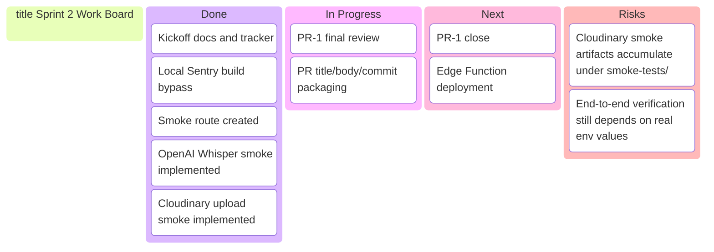

# Sprint 2 Status Dashboard

## Snapshot

- **Branch:** `sprint-2-core-loop`
- **Current phase:** `PR-1 External Dependency Validation`
- **Overall status:** `In progress`
- **Current goal:** close PR-1 by validating real OpenAI and Cloudinary dependency paths
- **Next major step:** Edge Function rollout after PR-1 closes

---

## Executive Dashboard

| Area | Status | Notes |
|---|---|---|
| Sprint 2 kickoff docs | Done | Kickoff and sprint tracking added |
| Local build unblock | Done | Sentry upload bypass added for local build |
| Smoke route skeleton | Done | `/api/smoke` created |
| OpenAI dependency check | Done | upgraded to real Whisper transcription smoke |
| Cloudinary dependency check | Done | upgraded to real upload smoke |
| PR-1 packaging | In progress | diff/PR text/commit text prepared |
| Edge Function deployment | Next | start after PR-1 closes |

---

## Current Position

```mermaid
flowchart LR
    A[Sprint 2 kickoff] --> B[PR-1 smoke route skeleton]
    B --> C[Real OpenAI Whisper smoke check]
    C --> D[Real Cloudinary upload smoke check]
    D --> E[PR-1 close]
    E --> F[Edge Function deployment]
    F --> G[Next integration phase]

    style A fill:#d1fae5,stroke:#10b981,color:#111827
    style B fill:#d1fae5,stroke:#10b981,color:#111827
    style C fill:#d1fae5,stroke:#10b981,color:#111827
    style D fill:#d1fae5,stroke:#10b981,color:#111827
    style E fill:#fef3c7,stroke:#f59e0b,color:#111827
    style F fill:#e5e7eb,stroke:#9ca3af,color:#111827
    style G fill:#e5e7eb,stroke:#9ca3af,color:#111827
```



**Reading guide**
- Green = done
- Yellow = current step
- Gray = upcoming

---

## Delivery Flow

```mermaid
flowchart TD
    U[Developer / local app] --> S[/api/smoke route]
    S --> T{X-Smoke-Token valid?}
    T -- No --> R1[401 Unauthorized]
    T -- Yes --> O[OpenAI Whisper transcription smoke]
    T -- Yes --> C[Cloudinary raw upload smoke]
    O --> M[Combined smoke response]
    C --> M
    M --> P[PR-1 can be closed]
    P --> E[Move to Edge Function deployment]

    style S fill:#dbeafe,stroke:#2563eb,color:#111827
    style O fill:#ede9fe,stroke:#7c3aed,color:#111827
    style C fill:#ecfccb,stroke:#65a30d,color:#111827
    style P fill:#fef3c7,stroke:#f59e0b,color:#111827
    style E fill:#e5e7eb,stroke:#9ca3af,color:#111827
```

---

## Work Board



---

## Risks / Notes

- Cloudinary smoke uploads leave tiny raw files under `smoke-tests/`
- This is acceptable for PR-1 because proving the real upload path is more important than cleanup right now
- Cleanup or retention policy can be added in a later PR if needed
- End-to-end success still depends on correct runtime env values:
  - `SMOKE_TOKEN`
  - `OPENAI_API_KEY`
  - `CLOUDINARY_CLOUD_NAME`
  - `CLOUDINARY_API_KEY`
  - `CLOUDINARY_API_SECRET`

---

## Recommended Next Action

**Close PR-1 first. Then move to Edge Function deployment.**
